# Yelo Laundry ERP — Entity Relationship Diagram

> **Status:** Enterprise ERD — relationship design only.  
> **Scope:** Single source of truth for backend database structure.  
> **Note:** Field definitions are intentionally excluded. Primary keys and foreign keys are expressed through entity relationships.

---

## Legend

| Symbol | Meaning |
|--------|---------|
| `\|\|--o\| ` | One-to-one |
| `\|\|--o{ ` | One-to-many |
| `}o--o{ ` | Many-to-many (via junction table) |
| **PK** | Primary key on parent or owning entity |
| **FK** | Foreign key on child or referencing entity |

---

## 1. Authentication

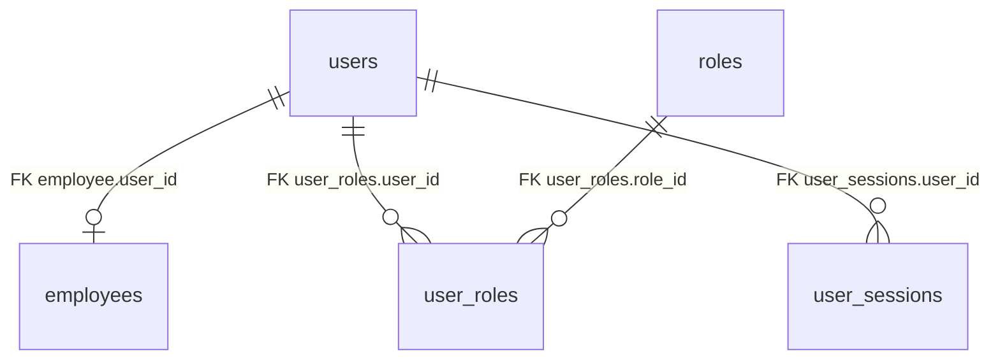

| Table | PK | Foreign Keys |
|-------|----|--------------|
| `users` | `id` | — |
| `roles` | `id` | — |
| `user_roles` | `id` | `user_id` → `users`, `role_id` → `roles` |
| `user_sessions` | `id` | `user_id` → `users` |

---

## 2. Employee

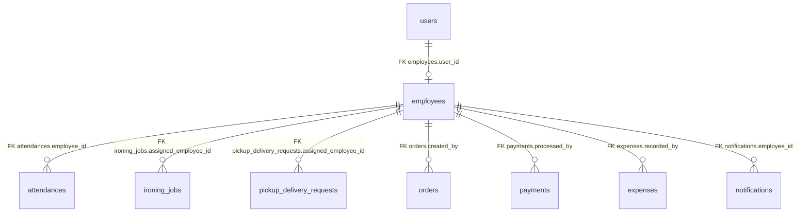

| Table | PK | Foreign Keys |
|-------|----|--------------|
| `employees` | `id` | `user_id` → `users` |
| `attendances` | `id` | `employee_id` → `employees` |
| `ironing_jobs` | `id` | `assigned_employee_id` → `employees` |
| `pickup_delivery_requests` | `id` | `assigned_employee_id` → `employees` |
| `orders` | `id` | `created_by` → `employees` |
| `payments` | `id` | `processed_by` → `employees` |
| `expenses` | `id` | `recorded_by` → `employees` |
| `notifications` | `id` | `employee_id` → `employees` |

---

## 3. Customer

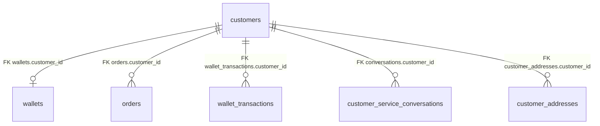

| Table | PK | Foreign Keys |
|-------|----|--------------|
| `customers` | `id` | — |
| `customer_addresses` | `id` | `customer_id` → `customers` |
| `wallets` | `id` | `customer_id` → `customers` |
| `orders` | `id` | `customer_id` → `customers` |
| `wallet_transactions` | `id` | `customer_id` → `customers` |
| `customer_service_conversations` | `id` | `customer_id` → `customers` |

---

## 4. Laundry Services

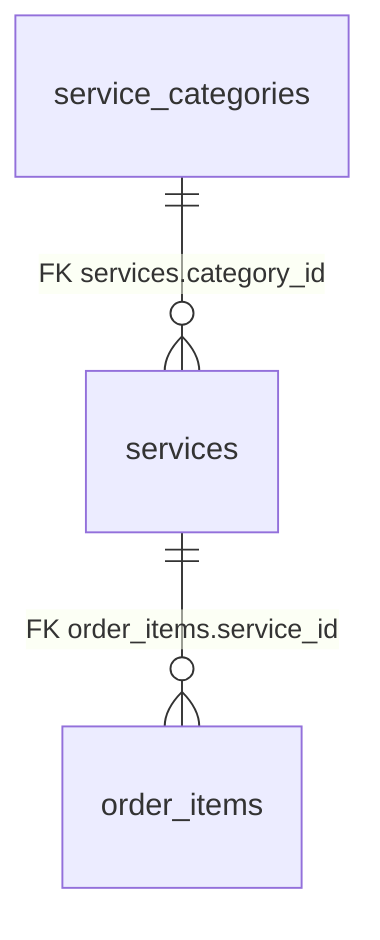

| Table | PK | Foreign Keys |
|-------|----|--------------|
| `service_categories` | `id` | — |
| `services` | `id` | `category_id` → `service_categories` |
| `order_items` | `id` | `service_id` → `services` |

---

## 5. Orders

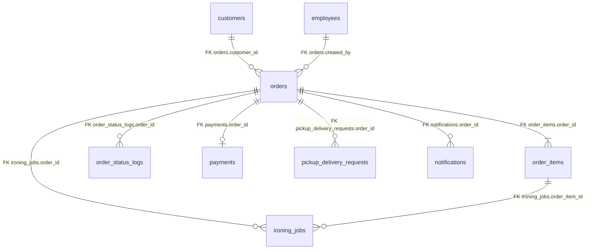

| Table | PK | Foreign Keys |
|-------|----|--------------|
| `orders` | `id` | `customer_id` → `customers`, `created_by` → `employees` |
| `order_items` | `id` | `order_id` → `orders`, `service_id` → `services` |
| `order_status_logs` | `id` | `order_id` → `orders` |

---

## 6. Finance

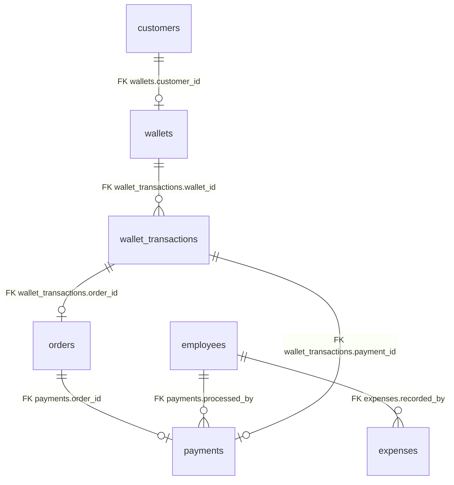

| Table | PK | Foreign Keys |
|-------|----|--------------|
| `wallets` | `id` | `customer_id` → `customers` |
| `wallet_transactions` | `id` | `wallet_id` → `wallets`, `customer_id` → `customers`, `order_id` → `orders`, `payment_id` → `payments` |
| `payments` | `id` | `order_id` → `orders`, `processed_by` → `employees` |
| `expenses` | `id` | `recorded_by` → `employees` |

---

## 7. Attendance

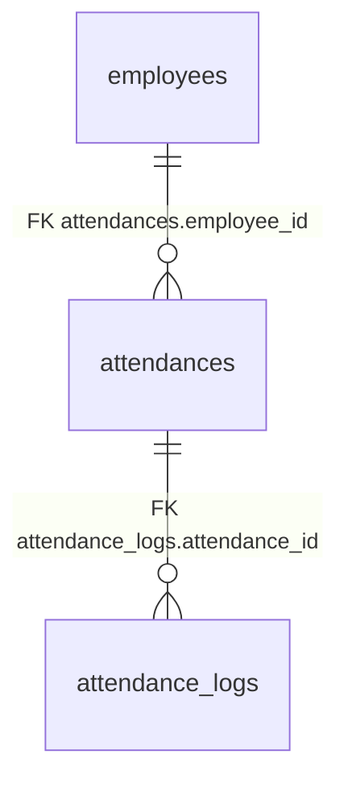

| Table | PK | Foreign Keys |
|-------|----|--------------|
| `attendances` | `id` | `employee_id` → `employees` |
| `attendance_logs` | `id` | `attendance_id` → `attendances` |

---

## 8. Binatu

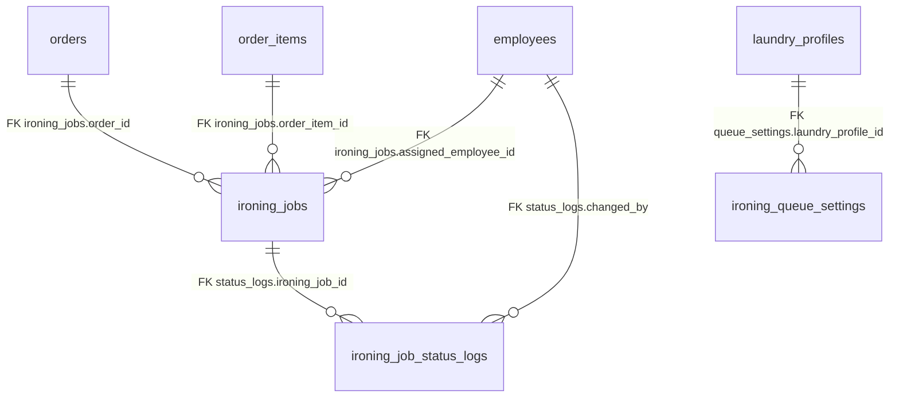

| Table | PK | Foreign Keys |
|-------|----|--------------|
| `ironing_jobs` | `id` | `order_id` → `orders`, `order_item_id` → `order_items`, `assigned_employee_id` → `employees` |
| `ironing_job_status_logs` | `id` | `ironing_job_id` → `ironing_jobs`, `changed_by` → `employees` |
| `ironing_queue_settings` | `id` | `laundry_profile_id` → `laundry_profiles` |

---

## 9. Pickup & Delivery

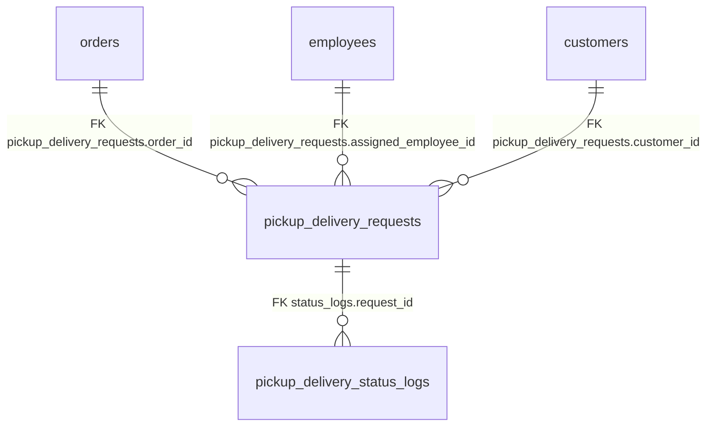

| Table | PK | Foreign Keys |
|-------|----|--------------|
| `pickup_delivery_requests` | `id` | `order_id` → `orders`, `customer_id` → `customers`, `assigned_employee_id` → `employees` |
| `pickup_delivery_status_logs` | `id` | `request_id` → `pickup_delivery_requests` |

---

## 10. Notifications

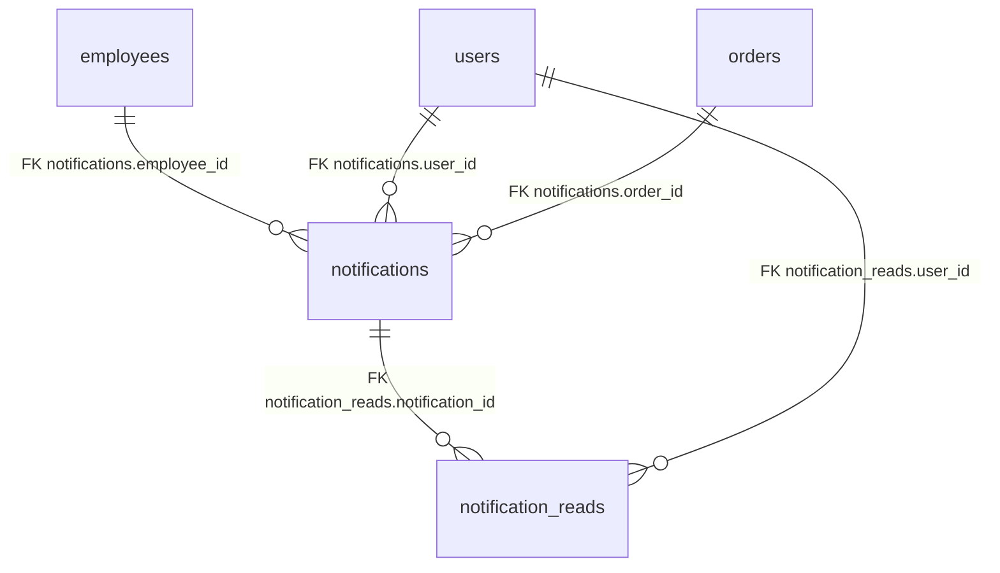

| Table | PK | Foreign Keys |
|-------|----|--------------|
| `notifications` | `id` | `user_id` → `users`, `employee_id` → `employees`, `order_id` → `orders` |
| `notification_reads` | `id` | `notification_id` → `notifications`, `user_id` → `users` |

---

## 11. Customer Service

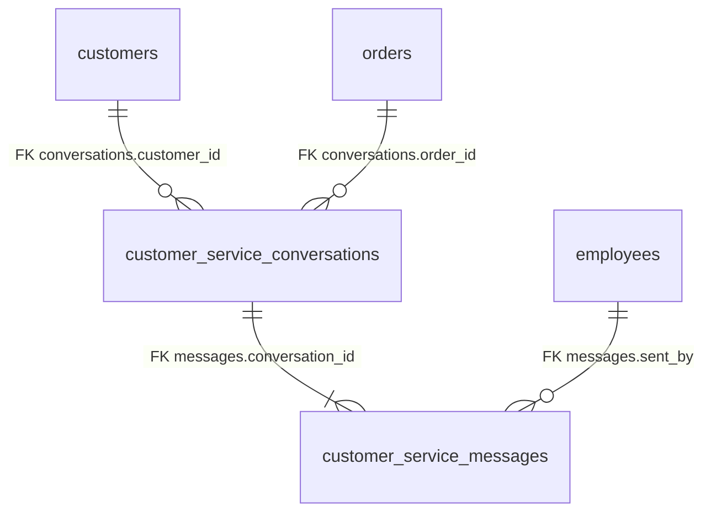

| Table | PK | Foreign Keys |
|-------|----|--------------|
| `customer_service_conversations` | `id` | `customer_id` → `customers`, `order_id` → `orders` |
| `customer_service_messages` | `id` | `conversation_id` → `customer_service_conversations`, `sent_by` → `employees` |

---

## 12. Settings

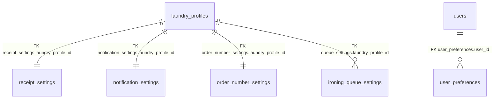

| Table | PK | Foreign Keys |
|-------|----|--------------|
| `laundry_profiles` | `id` | — |
| `receipt_settings` | `id` | `laundry_profile_id` → `laundry_profiles` |
| `notification_settings` | `id` | `laundry_profile_id` → `laundry_profiles` |
| `order_number_settings` | `id` | `laundry_profile_id` → `laundry_profiles` |
| `ironing_queue_settings` | `id` | `laundry_profile_id` → `laundry_profiles` |
| `user_preferences` | `id` | `user_id` → `users` |

---

## Complete Enterprise ERD

```mermaid
erDiagram
    %% Authentication
    users ||--o| employees : "user_id"
    users ||--o{ user_roles : "user_id"
    roles ||--o{ user_roles : "role_id"
    users ||--o{ user_sessions : "user_id"
    users ||--o{ user_preferences : "user_id"

    %% Customer
    customers ||--o| wallets : "customer_id"
    customers ||--o{ customer_addresses : "customer_id"
    customers ||--o{ orders : "customer_id"
    customers ||--o{ customer_service_conversations : "customer_id"
    customers ||--o{ pickup_delivery_requests : "customer_id"

    %% Laundry Services
    service_categories ||--o{ services : "category_id"
    services ||--o{ order_items : "service_id"

    %% Orders
    employees ||--o{ orders : "created_by"
    orders ||--|{ order_items : "order_id"
    orders ||--o{ order_status_logs : "order_id"
    order_items ||--o{ ironing_jobs : "order_item_id"

    %% Finance
    orders ||--o| payments : "order_id"
    employees ||--o{ payments : "processed_by"
    wallets ||--o{ wallet_transactions : "wallet_id"
    wallet_transactions }o--|| orders : "order_id"
    wallet_transactions }o--o| payments : "payment_id"
    employees ||--o{ expenses : "recorded_by"

    %% Attendance
    employees ||--o{ attendances : "employee_id"
    attendances ||--o{ attendance_logs : "attendance_id"

    %% Binatu
    orders ||--o{ ironing_jobs : "order_id"
    employees ||--o{ ironing_jobs : "assigned_employee_id"
    ironing_jobs ||--o{ ironing_job_status_logs : "ironing_job_id"
    employees ||--o{ ironing_job_status_logs : "changed_by"

    %% Pickup and Delivery
    orders ||--o{ pickup_delivery_requests : "order_id"
    employees ||--o{ pickup_delivery_requests : "assigned_employee_id"
    pickup_delivery_requests ||--o{ pickup_delivery_status_logs : "request_id"

    %% Notifications
    users ||--o{ notifications : "user_id"
    employees ||--o{ notifications : "employee_id"
    orders ||--o{ notifications : "order_id"
    notifications ||--o{ notification_reads : "notification_id"
    users ||--o{ notification_reads : "user_id"

    %% Customer Service
    orders }o--o{ customer_service_conversations : "order_id"
    customer_service_conversations ||--|{ customer_service_messages : "conversation_id"
    employees ||--o{ customer_service_messages : "sent_by"

    %% Settings
    laundry_profiles ||--|| receipt_settings : "laundry_profile_id"
    laundry_profiles ||--|| notification_settings : "laundry_profile_id"
    laundry_profiles ||--|| order_number_settings : "laundry_profile_id"
    laundry_profiles ||--o{ ironing_queue_settings : "laundry_profile_id"
```

---

## Entity Index

| # | Module | Tables |
|---|--------|--------|
| 1 | Authentication | `users`, `roles`, `user_roles`, `user_sessions` |
| 2 | Employee | `employees` |
| 3 | Customer | `customers`, `customer_addresses` |
| 4 | Laundry Services | `service_categories`, `services` |
| 5 | Orders | `orders`, `order_items`, `order_status_logs` |
| 6 | Finance | `wallets`, `wallet_transactions`, `payments`, `expenses` |
| 7 | Attendance | `attendances`, `attendance_logs` |
| 8 | Binatu | `ironing_jobs`, `ironing_job_status_logs`, `ironing_queue_settings` |
| 9 | Pickup & Delivery | `pickup_delivery_requests`, `pickup_delivery_status_logs` |
| 10 | Notifications | `notifications`, `notification_reads` |
| 11 | Customer Service | `customer_service_conversations`, `customer_service_messages` |
| 12 | Settings | `laundry_profiles`, `receipt_settings`, `notification_settings`, `order_number_settings`, `user_preferences` |

**Total tables:** 33

---

## Relationship Summary

| Parent Entity | Child Entity | Cardinality | FK Location |
|---------------|--------------|-------------|-------------|
| `users` | `employees` | 1 : 0..1 | `employees.user_id` |
| `users` | `user_roles` | 1 : N | `user_roles.user_id` |
| `roles` | `user_roles` | 1 : N | `user_roles.role_id` |
| `customers` | `orders` | 1 : N | `orders.customer_id` |
| `customers` | `wallets` | 1 : 1 | `wallets.customer_id` |
| `orders` | `order_items` | 1 : N | `order_items.order_id` |
| `services` | `order_items` | 1 : N | `order_items.service_id` |
| `orders` | `payments` | 1 : 0..1 | `payments.order_id` |
| `orders` | `ironing_jobs` | 1 : N | `ironing_jobs.order_id` |
| `orders` | `pickup_delivery_requests` | 1 : N | `pickup_delivery_requests.order_id` |
| `employees` | `ironing_jobs` | 1 : N | `ironing_jobs.assigned_employee_id` |
| `employees` | `attendances` | 1 : N | `attendances.employee_id` |
| `customers` | `customer_service_conversations` | 1 : N | `conversations.customer_id` |
| `customer_service_conversations` | `customer_service_messages` | 1 : N | `messages.conversation_id` |
| `laundry_profiles` | `receipt_settings` | 1 : 1 | `receipt_settings.laundry_profile_id` |
| `notifications` | `notification_reads` | 1 : N | `notification_reads.notification_id` |

---

## Design Principles

1. **Single outlet anchor** — `laundry_profiles` is the root settings entity per laundry outlet.
2. **Order-centric operations** — `orders` is the hub connecting finance, binatu, pickup/delivery, and notifications.
3. **Employee traceability** — all operational actions reference `employees` for audit.
4. **Status audit trails** — separate log tables for orders, ironing jobs, pickup/delivery, and attendance.
5. **Soft ownership** — customers own wallets; users own sessions and preferences; employees link to users.
