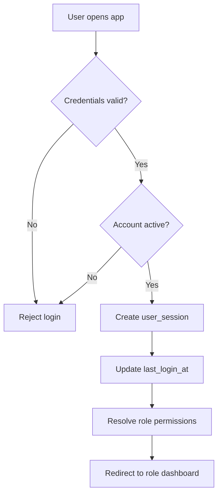
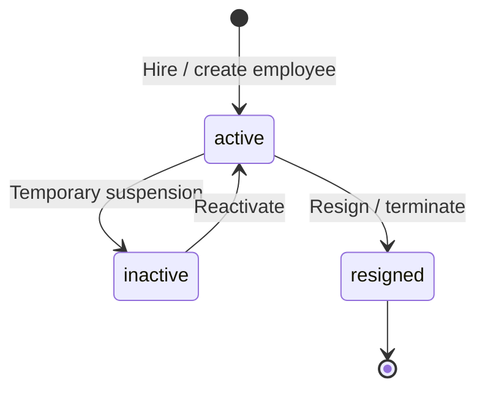
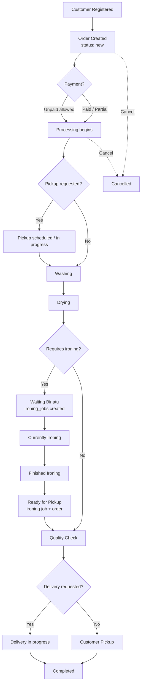
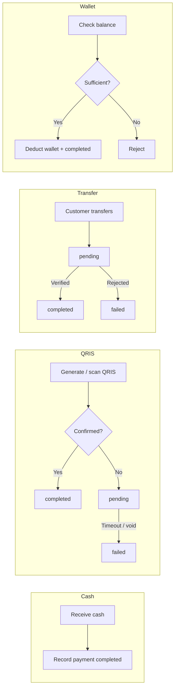
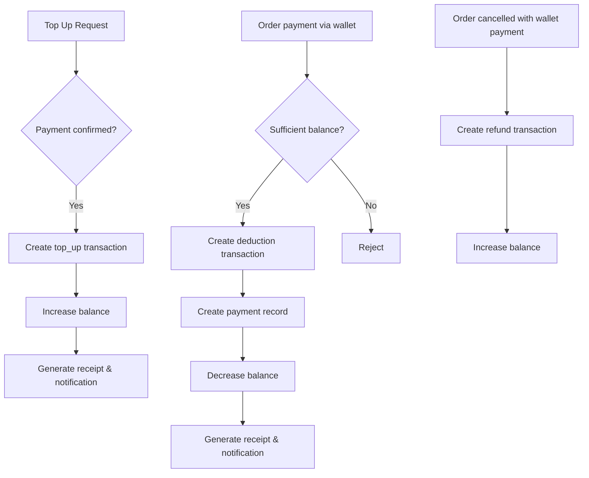
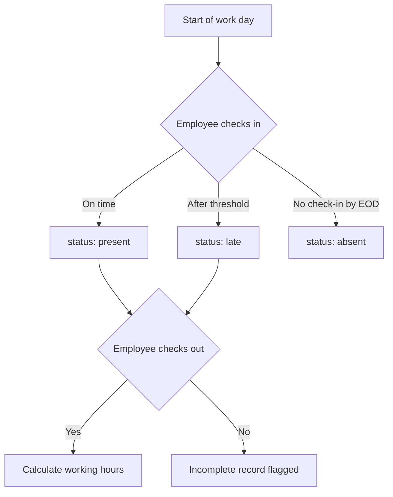
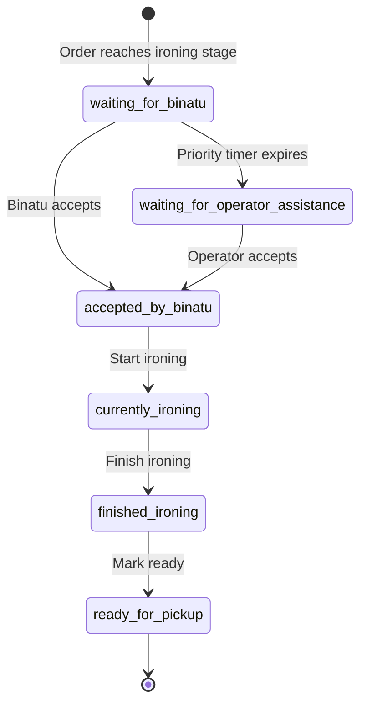
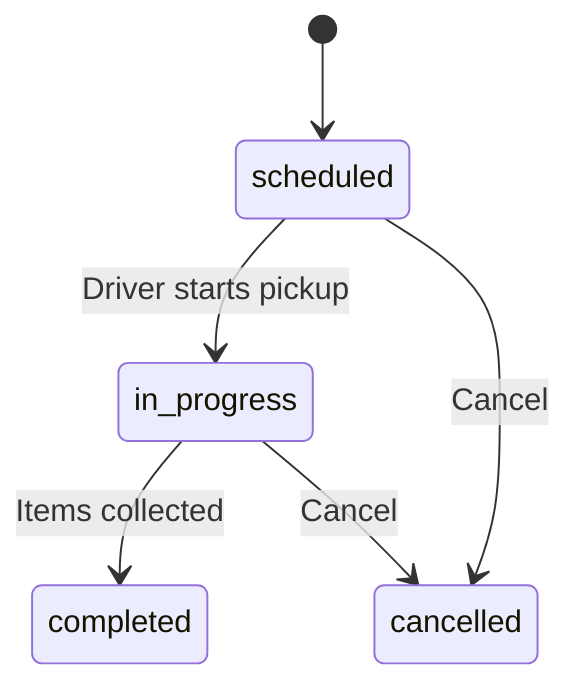
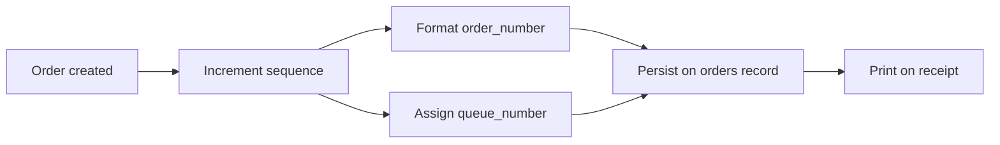

# Yelo Laundry ERP — Business Rules

> **Status:** Official business reference — pre-backend implementation.  
> **References:** [02_ERD.md](./02_ERD.md) · [03_DATA_DICTIONARY.md](./03_DATA_DICTIONARY.md)  
> **Scope:** Domain rules, lifecycle flows, role permissions, and notification triggers. No API, SQL, or code.

---

## Document Conventions

| Convention | Description |
|------------|-------------|
| Rule ID | Unique identifier per section (e.g. `AUTH-001`, `ORD-012`) |
| Actor | Person or system role performing the action |
| Must | Mandatory rule — violation blocks the operation |
| May | Optional or conditional rule |
| Shall not | Prohibited action |

**Role naming (display → database code):**

| Display Name | Role Code | Notes |
|--------------|-----------|-------|
| Owner | `owner` | Full administrative access |
| Kasir | `cashier` | Operational cashier (shared device) |
| Operator | `cashier_laundry` | Kasir + Binatu on personal device |
| Manajer | `cashier_laundry_driver` | Kasir + Binatu + Driver on personal device |
| Binatu | `laundry` | Ironing staff only |
| Driver | — | Capability within Manajer role, not a standalone login role |
| Customer | — | External party; no system login account |

---

## 1. Authentication Rules

### 1.1 Account & Login

| ID | Rule |
|----|------|
| AUTH-001 | Every system user **must** have a record in `users` with a unique `phone` number. |
| AUTH-002 | `email` is optional but, when provided, **must** be unique across active users. |
| AUTH-003 | Passwords **must** be stored as bcrypt hashes (`password_hash`); plain-text passwords **shall not** be persisted. |
| AUTH-004 | Only users with `status = active` **may** authenticate. `inactive` and `suspended` accounts **must** be rejected at login. |
| AUTH-005 | Successful login **must** update `users.last_login_at`. |
| AUTH-006 | Login **may** use phone number or email (when set) as the username identifier. |
| AUTH-007 | Each authenticated session **must** be tracked in `user_sessions` with `refresh_token_hash`, `expires_at`, and optional `device_info` / `ip_address`. |
| AUTH-008 | Logout or forced revocation **must** set `user_sessions.revoked_at`. Expired sessions **must** be treated as invalid. |
| AUTH-009 | A user **may** hold multiple roles via `user_roles`; effective permissions are the union of all assigned roles. |
| AUTH-010 | Role assignment **must** be recorded in `user_roles` with `assigned_at` and optional `assigned_by`. Duplicate `(user_id, role_id)` pairs **shall not** exist. |

### 1.2 Login Modes (Operational Context)

The application supports distinct operational login contexts that map to role codes:

| Login Mode | Role Code | Device Context |
|------------|-----------|----------------|
| Owner | `owner` | Any |
| Kasir — HP Operasional | `cashier` | Shared cashier device at counter |
| Kasir + Binatu — HP Pribadi | `cashier_laundry` | Employee personal phone |
| Kasir + Binatu + Driver — HP Pribadi | `cashier_laundry_driver` | Employee personal phone |
| Binatu | `laundry` | Employee personal phone |

| ID | Rule |
|----|------|
| AUTH-011 | Kasir (HP Operasional) **shall not** access personal attendance features. |
| AUTH-012 | Operator and Manajer **may** access personal attendance in addition to cashier functions. |
| AUTH-013 | Binatu login **must** route to the Binatu dashboard and **shall not** expose customer, payment, wallet, or financial report modules. |
| AUTH-014 | After authentication, the user **must** be redirected to the dashboard matching their highest-privilege active role, or the role selected at login when multiple roles exist. |

### 1.3 Authentication Flow



---

## 2. Employee Rules

### 2.1 Employee Master Data

| ID | Rule |
|----|------|
| EMP-001 | Every employee **must** have a unique `employee_code`. |
| EMP-002 | `full_name`, `phone`, and `position` are mandatory. |
| EMP-003 | An employee **may** be linked to at most one `users` record (`employees.user_id` is unique when set). |
| EMP-004 | Employees without login access **may** have `user_id = NULL` (e.g. non-digital staff tracked for attendance only). |
| EMP-005 | Employment `status` **must** be one of: `active`, `inactive`, `resigned`. |
| EMP-006 | Only `active` employees **may** be assigned to orders, ironing jobs, pickup/delivery, or process payments. |
| EMP-007 | Employee deletion **must** use soft delete (`deleted_at`); historical records (orders, payments, attendance) **must** retain the employee reference. |
| EMP-008 | `position` values (e.g. Kasir, Binatu, Driver) are informational; authorization is enforced through `roles`, not `position`. |

### 2.2 Employee Lifecycle



| ID | Rule |
|----|------|
| EMP-009 | Owner **may** create, update, and deactivate employees. |
| EMP-010 | Kasir, Operator, Manajer, and Binatu **shall not** access employee master management. |
| EMP-011 | When an employee is linked to a user account, deactivating the employee **should** also suspend the linked user account. |

---

## 3. Role Permission Rules

### 3.1 Module Access Matrix

| Module | Owner | Kasir | Operator | Manajer | Binatu |
|--------|:-----:|:-----:|:--------:|:-------:|:------:|
| Dashboard (role-specific) | ✓ | ✓ | ✓ | ✓ | ✓ |
| Customer management | ✓ | ✓ | ✓ | ✓ | ✗ |
| Order creation & management | ✓ | ✓ | ✓ | ✓ | ✗ |
| Pickup & Delivery | ✓ | ✓ | ✓ | ✓ | ✗ |
| Yelo Wallet | ✓ | ✓ | ✓ | ✓ | ✗ |
| Customer Service Center | ✓ | ✓ | ✓ | ✓ | ✗ |
| Notification Center | ✓ | ✓ | ✓ | ✓ | ✓ |
| Personal attendance | ✗ | ✗ | ✓ | ✓ | ✓ |
| Team attendance (Owner view) | ✓ | ✗ | ✗ | ✗ | ✗ |
| Ironing queue & job actions | ✓ | ✗ | ✓ | ✓ | ✓ |
| Operator ironing assistance | ✗ | ✗ | ✓ | ✓ | ✗ |
| Expenses | ✓ | ✗ | ✗ | ✗ | ✗ |
| Revenue & financial reports | ✓ | ✗ | ✗ | ✗ | ✗ |
| Employee KPI / monitoring | ✓ | ✗ | ✗ | ✗ | ✗ |
| Employee master | ✓ | ✗ | ✗ | ✗ | ✗ |
| Laundry profile & system settings | ✓ | ✗ | ✗ | ✗ | ✗ |
| Receipt customization (full) | ✓ | ✗ | ✗ | ✗ | ✗ |
| Receipt printer settings | ✓ | ✓ | ✓ | ✓ | ✗ |
| Order/queue number settings (read) | ✓ | ✓ | ✓ | ✓ | ✗ |
| Order/queue number settings (edit) | ✓ | ✗ | ✗ | ✗ | ✗ |
| AI Planner | ✓ | ✗ | ✗ | ✗ | ✗ |

### 3.2 Action-Level Permissions

| ID | Rule |
|----|------|
| PERM-001 | Users **may** only access routes and actions permitted by their active role; unauthorized access **must** redirect to the role dashboard. |
| PERM-002 | Owner **may** perform all CRUD operations on master data, settings, and financial records. |
| PERM-003 | Kasir **may** create customers, orders, payments, wallet transactions, pickup/delivery requests, and receipts. |
| PERM-004 | Operator **may** perform all Kasir actions plus accept personal ironing jobs and operator assistance jobs. |
| PERM-005 | Manajer **may** perform all Operator actions plus execute pickup and delivery assignments (Driver capability). |
| PERM-006 | Binatu **may** view and act on assigned ironing queue jobs and personal attendance only. |
| PERM-007 | Binatu **shall not** create or modify orders, process payments, or access wallet balances. |
| PERM-008 | Order cancellation **may** be performed by Owner and Kasir (and roles inheriting Kasir permissions: Operator, Manajer). |
| PERM-009 | Expense recording **may** only be performed by Owner. |
| PERM-010 | Ironing queue priority settings (`ironing_queue_settings`) **may** only be modified by Owner. |

### 3.3 Customer (External) Access

| ID | Rule |
|----|------|
| PERM-011 | Customers **do not** have ERP login accounts. Customer interaction is via WhatsApp, printed receipts, and in-person service. |
| PERM-012 | Customers **may** receive outbound WhatsApp status updates initiated by staff; they **shall not** directly change order status in the ERP. |

---

## 4. Customer Rules

### 4.1 Registration & Identity

| ID | Rule |
|----|------|
| CUS-001 | Every customer **must** have a unique `phone` number (WhatsApp / contact). |
| CUS-002 | `full_name` is mandatory. |
| CUS-003 | `customer_code` **must** be auto-generated and unique. |
| CUS-004 | Phone numbers **must** conform to Indonesian mobile format: `+62`, `62`, or `0` prefix followed by `8x` and 6–11 additional digits. |
| CUS-005 | Phone numbers **must** be normalized to `+62` format before storage. |
| CUS-006 | `email` is optional. |
| CUS-007 | Customer `status` **must** be `active` or `inactive`. Only `active` customers **may** receive new orders. |
| CUS-008 | Customer deletion **must** use soft delete (`deleted_at`). |

### 4.2 Addresses

| ID | Rule |
|----|------|
| CUS-009 | A customer **may** have multiple addresses in `customer_addresses`. |
| CUS-010 | Each address **must** have `address_line`. `label` (e.g. Rumah, Kantor) and `maps_query` are optional. |
| CUS-011 | At most one address per customer **may** have `is_default = TRUE`. Setting a new default **must** clear the previous default. |
| CUS-012 | Pickup and delivery requests **should** snapshot address data at request time to preserve historical accuracy. |

### 4.3 Loyalty & Wallet Link

| ID | Rule |
|----|------|
| CUS-013 | `loyalty_points` defaults to `0` and **may** be incremented by future loyalty programs (out of scope for initial backend). |
| CUS-014 | A wallet record (`wallets`) **should** be auto-created when a customer is registered or on first wallet top-up. |
| CUS-015 | Customer lookup for order creation **should** prioritize phone number search. |

---

## 5. Order Rules

### 5.1 Order Creation

| ID | Rule |
|----|------|
| ORD-001 | Every order **must** be linked to a registered, active customer (`orders.customer_id`). |
| ORD-002 | Every order **must** have a unique `order_number` per laundry outlet. |
| ORD-003 | Every order **must** contain at least one line item in `order_items`. |
| ORD-004 | `created_by` **must** reference the employee who created the order. |
| ORD-005 | `subtotal` **must** equal the sum of all `order_items.line_total`. |
| ORD-006 | `total_amount` **must** equal `subtotal - discount_amount`. `discount_amount` **must not** exceed `subtotal`. |
| ORD-007 | `unit_price` on each line item **must** be captured at order time (price snapshot); subsequent service price changes **must not** retroactively alter existing orders. |
| ORD-008 | `estimated_completion` **should** be set at order creation based on service type and workload. |
| ORD-009 | A customer-facing queue number **must** be assigned at order creation (see Section 15). |
| ORD-010 | Orders containing services with `requires_ironing = TRUE` **must** generate corresponding `ironing_jobs` when the order reaches the ironing stage. |

### 5.2 Order Status Values

Database field `orders.status` allowed values:

| Status Code | Display Label | Description |
|-------------|---------------|-------------|
| `new` | Order Baru | Order created, awaiting processing |
| `in_progress` | Dalam Proses | General processing started |
| `washing` | Sedang Dicuci | Washing in progress |
| `drying` | Sedang Dikeringkan | Drying in progress |
| `ironing` | Sedang Disetrika | Ironing stage (linked to `ironing_jobs`) |
| `quality_check` | Quality Check | Final inspection before handover |
| `ready_for_pickup` | Siap Diambil | Ready for customer pickup or delivery dispatch |
| `completed` | Selesai | Order fulfilled and closed |
| `cancelled` | Dibatalkan | Order cancelled |

### 5.3 Complete Order Lifecycle



**Linear progression (typical self-pickup, with ironing):**

```
Customer Created
    ↓
Order Created (new)
    ↓
Payment (optional timing — see Section 6)
    ↓
Washing (washing)
    ↓
Drying (drying)
    ↓
Waiting Binatu (ironing) → ironing_jobs.status = waiting_for_binatu
    ↓
Currently Ironing → currently_ironing
    ↓
Finished Ironing → finished_ironing
    ↓
Ready for Pickup → ready_for_pickup
    ↓
Quality Check (quality_check)
    ↓
Completed (completed)
```

### 5.4 Status Transition Rules

| ID | Rule |
|----|------|
| ORD-011 | Every status change **must** be recorded in `order_status_logs` with `from_status`, `to_status`, `changed_by`, and `changed_at`. |
| ORD-012 | Status transitions **should** follow the logical process sequence; skipping stages **may** be allowed for Owner and Kasir with a mandatory note. |
| ORD-013 | An order **must not** be set to `ready_for_pickup` or `completed` while `payment_status = unpaid`, unless explicitly overridden by Owner. |
| ORD-014 | An order **must not** be set to `completed` until all ironing jobs (if any) are `ready_for_pickup` or the order has passed quality check. |
| ORD-015 | Setting order status to `completed` **must** set `orders.completed_at`. |
| ORD-016 | Order cancellation **may** only occur when status is not `completed`. Cancellation **must** set status to `cancelled` and log the reason. |
| ORD-017 | Cancelled orders **shall not** accept new payments; existing payments **must** follow refund rules (Section 6). |
| ORD-018 | When fulfillment type is Pickup, the `pickup` workflow step **must** occur before washing. |
| ORD-019 | When fulfillment type is Delivery, the order **must** pass through `ready_for_pickup` before delivery dispatch. |

### 5.5 Payment Status on Orders

| `payment_status` | Meaning |
|------------------|---------|
| `unpaid` | No payment received |
| `partial` | Partial payment received; balance remains |
| `paid` | Fully paid |

| ID | Rule |
|----|------|
| ORD-020 | `payment_status` **must** be derived from the sum of completed `payments` for the order. |
| ORD-021 | `payment_status` **must** automatically update to `paid` when total payments ≥ `total_amount`. |

---

## 6. Payment Rules

### 6.1 Payment Methods

| Method Code | Display | Description |
|-------------|---------|-------------|
| `cash` | Cash | Cash payment at counter |
| `qris` | QRIS | QRIS electronic payment |
| `transfer` | Transfer | Bank transfer |
| `wallet` | Yelo Wallet | Deducted from customer prepaid wallet |

### 6.2 Payment Status

| Status Code | Display | Description |
|-------------|---------|-------------|
| `pending` | Pending | Payment initiated, awaiting confirmation |
| `completed` | Paid / Lunas | Payment confirmed and recorded |
| `failed` | Failed / Cancelled | Payment attempt failed or voided |

| ID | Rule |
|----|------|
| PAY-001 | Every payment **must** reference an `order_id` and `processed_by` employee. |
| PAY-002 | `amount` **must** be greater than zero. |
| PAY-003 | Cash payments **may** be recorded as `completed` immediately upon receipt. |
| PAY-004 | QRIS and transfer payments **may** start as `pending` until confirmation; upon confirmation they **must** transition to `completed`. |
| PAY-005 | Wallet payments **must** validate sufficient wallet balance before recording; insufficient balance **must** reject the payment. |
| PAY-006 | The sum of `completed` payments for an order **must not** exceed `orders.total_amount` unless an overpayment adjustment workflow is applied. |
| PAY-007 | Partial payments **must** set `orders.payment_status = partial`. |
| PAY-008 | Full payment **must** set `orders.payment_status = paid`. |
| PAY-009 | A `pending` payment **may** be cancelled (set to `failed`) by Kasir or above before completion. |
| PAY-010 | Cancelling a `completed` payment requires a refund (Section 6.4). |

### 6.3 Payment Flow by Method



### 6.4 Refund Rules

| ID | Rule |
|----|------|
| PAY-011 | Refunds **may** be issued for `completed` payments when an order is cancelled or an overpayment occurred. |
| PAY-012 | Refund to wallet **must** create a `wallet_transactions` record with `transaction_type = refund` and link to the original `payment_id`. |
| PAY-013 | Cash / QRIS / transfer refunds **must** be recorded as a negative-amount adjustment or a reversal payment entry with audit trail; the original payment record **must not** be deleted. |
| PAY-014 | After full refund, `orders.payment_status` **must** revert to `unpaid`. |
| PAY-015 | Refunds **may** only be processed by Owner or Kasir (and inheriting roles). |

### 6.5 Payment Notification Triggers

| Event | Notification Type |
|-------|-------------------|
| Cash payment completed | `cash_payment` |
| QRIS payment completed | `qris_payment` |
| Transfer payment completed | `transfer_payment` |

---

## 7. Wallet Rules

### 7.1 Wallet Account

| ID | Rule |
|----|------|
| WAL-001 | Each customer **may** have at most one active wallet (`wallets.customer_id` is unique). |
| WAL-002 | Initial `balance` is `0.00` IDR. |
| WAL-003 | `balance` **must not** go below zero. |
| WAL-004 | Wallet currency **must** match outlet default (`IDR`). |

### 7.2 Top Up

| ID | Rule |
|----|------|
| WAL-005 | Top-up **must** create a `wallet_transactions` record with `transaction_type = top_up`. |
| WAL-006 | Top-up **must** be funded by a confirmed payment method (cash, QRIS, or transfer) before crediting the wallet. |
| WAL-007 | Top-up amount **must** be greater than zero. |
| WAL-008 | Top-up **must** record `balance_before`, `balance_after`, `processed_by`, and `reference_number`. |
| WAL-009 | Top-up **must** increase `wallets.balance` atomically with the transaction record. |
| WAL-010 | Top-up **must** generate notification type `wallet_top_up` (see Section 12). |
| WAL-011 | Top-up **must** generate a wallet top-up receipt (see Section 14). |

### 7.3 Deduction

| ID | Rule |
|----|------|
| WAL-012 | Deduction **must** create a `wallet_transactions` record with `transaction_type = deduction`. |
| WAL-013 | Deduction **must** reference the related `order_id` and resulting `payment_id`. |
| WAL-014 | Deduction amount **must** be ≤ current wallet balance; otherwise the operation **must** fail. |
| WAL-015 | Deduction **must** record `balance_before`, `balance_after`, `processed_by`, and `reference_number`. |
| WAL-016 | Deduction **must** decrease `wallets.balance` atomically with the transaction record. |
| WAL-017 | Deduction **must** generate notification type `wallet_deduction`. |
| WAL-018 | Deduction **must** generate a wallet deduction receipt. |

### 7.4 Refund to Wallet

| ID | Rule |
|----|------|
| WAL-019 | Refund **must** use `transaction_type = refund` and increase balance. |
| WAL-020 | Refund **must** reference the original payment or order. |

### 7.5 Balance Update Integrity

| ID | Rule |
|----|------|
| WAL-021 | `balance_after` of each transaction **must** equal `balance_before ± amount` depending on type. |
| WAL-022 | The latest `wallets.balance` **must** always equal the `balance_after` of the most recent transaction. |
| WAL-023 | All wallet mutations **must** be auditable; direct balance edits **shall not** be permitted outside transaction records. |
| WAL-024 | Wallet transaction `reference_number` **must** be unique when provided. |

### 7.6 Wallet Flow



---

## 8. Attendance Rules

### 8.1 Attendance Status Values

Database field `attendances.status`:

| Status Code | Display (UI) | Description |
|-------------|--------------|-------------|
| `present` | Hadir | Employee checked in on time |
| `late` | Terlambat | Employee checked in after grace period |
| `absent` | Belum Absen / Absen | No check-in recorded for the work day |
| `half_day` | Izin / Sakit (partial) | Partial day or approved leave |

> **Note:** The UI also displays `izin` and `sakit` as leave types. These **should** map to `half_day` or a future `leave` status with `notes` indicating leave type. Until extended, leave **must** be recorded with `notes` and appropriate status.

### 8.2 Check In

| ID | Rule |
|----|------|
| ATT-001 | Each employee **may** have at most one attendance record per `work_date` (`employee_id + work_date` is unique). |
| ATT-002 | Check-in **must** create or update `attendances.clock_in` and an `attendance_logs` entry with `event_type = clock_in`. |
| ATT-003 | Check-in **may** capture GPS coordinates (`latitude`, `longitude`) in `attendance_logs`. |
| ATT-004 | An employee **must not** check in twice on the same day; second check-in attempts **must** be rejected. |
| ATT-005 | Check-in on a day marked as leave (izin/sakit) **must** be rejected. |
| ATT-006 | If check-in occurs after the configured late threshold, status **must** be set to `late` instead of `present`. |

### 8.3 Check Out

| ID | Rule |
|----|------|
| ATT-007 | Check-out **requires** a prior check-in on the same day. |
| ATT-008 | Check-out **must** set `attendances.clock_out` and create an `attendance_logs` entry with `event_type = clock_out`. |
| ATT-009 | An employee **must not** check out twice on the same day. |
| ATT-010 | Check-out **may** capture GPS coordinates. |

### 8.4 Working Hours

| ID | Rule |
|----|------|
| ATT-011 | Working hours **must** be calculated as `clock_out - clock_in` when both are present. |
| ATT-012 | Working hours **should** be displayed in hours and minutes (e.g. "8 Jam 30 Menit"). |
| ATT-013 | Working hours **must not** be calculated until check-out is recorded. |

### 8.5 Late

| ID | Rule |
|----|------|
| ATT-014 | Late threshold **should** be configurable per outlet (default: check-in after scheduled start time + grace period). |
| ATT-015 | Late employees **must** have `status = late` for that `work_date`. |
| ATT-016 | Owner **may** view aggregate late count for the day on the team attendance dashboard. |

### 8.6 Absent

| ID | Rule |
|----|------|
| ATT-017 | If no check-in is recorded by end of work day, the system **should** mark the employee as `absent` via end-of-day batch job. |
| ATT-018 | Absent employees **must** have `clock_in = NULL` and `clock_out = NULL`. |
| ATT-019 | Owner **may** manually correct attendance records; Binatu and Operator **may** only view and manage their own attendance. |

### 8.7 Attendance Access by Role

| Role | Team Attendance | Personal Attendance |
|------|:---------------:|:-------------------:|
| Owner | ✓ (full) | ✗ |
| Kasir | ✗ | ✗ |
| Operator | ✗ | ✓ |
| Manajer | ✗ | ✓ |
| Binatu | ✗ | ✓ |

### 8.8 Attendance Flow



---

## 9. Binatu Rules

### 9.1 Ironing Job Status Values

Database field `ironing_jobs.status`:

| Status Code | Display Label |
|-------------|---------------|
| `waiting_for_binatu` | Waiting for Binatu |
| `waiting_for_operator_assistance` | Waiting for Operator Assistance |
| `accepted_by_binatu` | Accepted by Binatu |
| `currently_ironing` | Currently Ironing |
| `finished_ironing` | Finished Ironing |
| `ready_for_pickup` | Ready for Pickup |

### 9.2 Ironing Job Lifecycle



### 9.3 Priority Binatu

| ID | Rule |
|----|------|
| BIN-001 | When priority queue is enabled (`ironing_queue_settings.is_enabled = TRUE`), new ironing jobs **must** enter `waiting_for_binatu` with `waiting_started_at` set to current timestamp. |
| BIN-002 | Binatu staff **must** have exclusive acceptance rights during the priority window (`binatu_priority_minutes`, default 5 minutes). |
| BIN-003 | During the priority window, only Binatu role **may** accept jobs in `waiting_for_binatu` status. |
| BIN-004 | Allowed priority window values: 3, 5, 10, or 15 minutes (configurable by Owner). |
| BIN-005 | Queue sorting during priority window **must** use `waiting_started_at` ascending (FIFO). |

### 9.4 Waiting Timer & Operator Assistance

| ID | Rule |
|----|------|
| BIN-006 | When elapsed wait time ≥ `binatu_priority_minutes` and operator assistance is enabled, the job **must** transition to `waiting_for_operator_assistance`. |
| BIN-007 | Transition to operator assistance **must** set `operatorAssistanceAvailableAt` (stored as job metadata / timestamp). |
| BIN-008 | Operator assistance **must** generate an operator assistance notification to Operator and Manajer roles. |
| BIN-009 | If operator assistance is disabled, jobs **remain** in `waiting_for_binatu` until accepted by Binatu. |
| BIN-010 | If priority queue is disabled (`is_enabled = FALSE`), jobs **may** be accepted immediately by any authorized ironing staff without a waiting timer. |

### 9.5 Accept Job

| ID | Rule |
|----|------|
| BIN-011 | Binatu acceptance **may** only occur when status is `waiting_for_binatu`. |
| BIN-012 | Operator acceptance **may** only occur when status is `waiting_for_operator_assistance` and operator assistance is enabled. |
| BIN-013 | Accepting a job **must** set status to `accepted_by_binatu`, `assigned_employee_id`, and `accepted_at`. |
| BIN-014 | Operator-accepted jobs **must** set `is_operator_assistance = TRUE`. |
| BIN-015 | Binatu-accepted jobs **must** set `is_operator_assistance = FALSE`. |
| BIN-016 | Accepting a job **must** resolve any pending operator assistance notification for that order. |
| BIN-017 | Accepting a job **must** generate notification type `binatu_accepted`. |
| BIN-018 | A job **may** only be assigned to one employee at a time. |

### 9.6 Start & Finish Job

| ID | Rule |
|----|------|
| BIN-019 | Starting ironing **may** only occur from `accepted_by_binatu`; status **must** change to `currently_ironing` and `started_at` **must** be set. |
| BIN-020 | Finishing ironing **may** only occur from `currently_ironing`; status **must** change to `finished_ironing` and `finished_at` **must** be set. |
| BIN-021 | Finishing ironing **must** generate notification type `ironing_finished`. |
| BIN-022 | Operator-assisted completions **should** be tracked separately for KPI (operator assistance completed count). |

### 9.7 Ready for Pickup

| ID | Rule |
|----|------|
| BIN-023 | Marking ready for pickup **may** only occur from `finished_ironing`. |
| BIN-024 | Status **must** change to `ready_for_pickup` and `ready_at` **must** be set. |
| BIN-025 | Ready for pickup **must** generate notification type `ready_for_pickup` to Kasir and Owner. |
| BIN-026 | When all ironing jobs for an order are `ready_for_pickup`, the parent order **should** advance to `quality_check` or `ready_for_pickup` as appropriate. |
| BIN-027 | Every ironing status change **must** be logged in `ironing_job_status_logs`. |

### 9.8 Binatu Dashboard Queues

| Queue View | Included Statuses |
|------------|-------------------|
| Ironing Queue | `waiting_for_binatu`, `waiting_for_operator_assistance`, `accepted_by_binatu` |
| Currently Ironing | `currently_ironing` |
| Finished Ironing | `finished_ironing` |
| Ready for Pickup | `ready_for_pickup` |

---

## 10. Pickup Rules

### 10.1 Pickup Request

| ID | Rule |
|----|------|
| PICK-001 | A pickup request **must** be created in `pickup_delivery_requests` with `request_type = pickup`. |
| PICK-002 | Pickup request **must** reference `order_id`, `customer_id`, and snapshot `customer_name`, `customer_phone`, `address`. |
| PICK-003 | `scheduled_date` is mandatory; `pickup_time` is optional but recommended. |
| PICK-004 | Pickup **may** only be scheduled for orders with fulfillment type Pickup. |

### 10.2 Pickup Status Lifecycle

| Status Code | Description |
|-------------|-------------|
| `scheduled` | Pickup scheduled, awaiting driver |
| `in_progress` | Driver en route or collecting laundry |
| `completed` | Laundry collected and brought to outlet |
| `cancelled` | Pickup cancelled |



| ID | Rule |
|----|------|
| PICK-005 | Assigning a driver **must** set `assigned_employee_id` (Manajer role employee). |
| PICK-006 | Completing pickup **must** set `completed_at` and advance the parent order to `washing` (or `in_progress`). |
| PICK-007 | Every pickup status change **must** be logged in `pickup_delivery_status_logs`. |
| PICK-008 | Completing pickup **must** generate notification type `pickup_request` (status update). |
| PICK-009 | Pickup cancellation **must** set status to `cancelled` with a reason in `notes`. |

---

## 11. Delivery Rules

### 11.1 Delivery Request

| ID | Rule |
|----|------|
| DEL-001 | A delivery request **must** be created with `request_type = delivery`. |
| DEL-002 | Delivery **may** only be scheduled when the order has reached `ready_for_pickup` or `quality_check`. |
| DEL-003 | Delivery request **must** snapshot customer contact and address data. |
| DEL-004 | `scheduled_date` is mandatory; `delivery_time` is optional. |

### 11.2 Delivery Status Lifecycle

| Status Code | Description |
|-------------|-------------|
| `scheduled` | Delivery scheduled |
| `in_progress` | Driver en route to customer |
| `completed` | Laundry delivered to customer |
| `cancelled` | Delivery cancelled |

| ID | Rule |
|----|------|
| DEL-005 | Only Manajer (Driver capability) **may** be assigned as `assigned_employee_id`. |
| DEL-006 | Starting delivery **must** set status to `in_progress` and order status to delivery step. |
| DEL-007 | Completing delivery **must** set `completed_at` and advance order to `completed`. |
| DEL-008 | Every delivery status change **must** be logged in `pickup_delivery_status_logs`. |
| DEL-009 | Delivery dispatch **must** generate notification type `delivery_request`. |
| DEL-010 | Delivery **must not** proceed for unpaid orders unless Owner override is applied. |

---

## 12. Notification Rules

### 12.1 Notification Storage

| ID | Rule |
|----|------|
| NOT-001 | All notifications **must** be persisted in `notifications` with `type`, `title`, `message`, and optional `metadata` (JSONB). |
| NOT-002 | Notifications **must** reference `order_id` when related to an order. |
| NOT-003 | Employee-scoped notifications **must** set `employee_id`; user-scoped notifications **must** set `user_id`. |
| NOT-004 | Read status **must** be tracked per user in `notification_reads`. |
| NOT-005 | Opening a notification list page **should** mark relevant notifications as read for the current user. |
| NOT-006 | Outlet-level notification toggles in `notification_settings` **must** be respected before dispatching. |

### 12.2 Notification Types

| Type Code | Trigger Event |
|-----------|---------------|
| `new_order` | New order created |
| `cash_payment` | Cash payment completed |
| `qris_payment` | QRIS payment completed |
| `transfer_payment` | Bank transfer payment completed |
| `wallet_top_up` | Wallet top-up completed |
| `wallet_deduction` | Wallet balance deducted for order payment |
| `binatu_accepted` | Ironing job accepted by Binatu or Operator |
| `ironing_finished` | Ironing job finished |
| `ready_for_pickup` | Order / ironing job ready for customer pickup |
| `pickup_request` | Pickup request created or status changed |
| `delivery_request` | Delivery request created or status changed |
| `expense_recorded` | New expense recorded by Owner |

### 12.3 Notification Recipients by Role

| Event | Owner | Kasir | Operator | Manajer | Binatu | Driver | Customer |
|-------|:-----:|:-----:|:--------:|:-------:|:------:|:------:|:--------:|
| New order (`new_order`) | ✓ | ✓ | ✓ | ✓ | ✓ | — | — |
| Cash payment (`cash_payment`) | ✓ | ✓ | — | — | — | — | — |
| QRIS payment (`qris_payment`) | ✓ | ✓ | — | — | — | — | — |
| Transfer payment (`transfer_payment`) | ✓ | ✓ | — | — | — | — | — |
| Wallet top-up (`wallet_top_up`) | ✓ | ✓ | — | — | — | — | — |
| Wallet deduction (`wallet_deduction`) | ✓ | ✓ | — | — | — | — | — |
| Binatu accepted (`binatu_accepted`) | ✓ | ✓ | — | — | ✓ | — | — |
| Ironing finished (`ironing_finished`) | ✓ | ✓ | — | — | ✓ | — | — |
| Ready for pickup (`ready_for_pickup`) | ✓ | ✓ | ✓ | ✓ | ✓ | — | ✓ (WhatsApp) |
| Operator assistance needed | — | — | ✓ | ✓ | — | — | — |
| New ironing job (Binatu queue) | — | — | — | — | ✓ | — | — |
| Pickup request (`pickup_request`) | ✓ | ✓ | ✓ | ✓ | — | ✓ | ✓ (WhatsApp) |
| Delivery request (`delivery_request`) | ✓ | ✓ | ✓ | ✓ | — | ✓ | ✓ (WhatsApp) |
| Expense recorded (`expense_recorded`) | ✓ | — | — | — | — | — | — |

> **Driver** notifications are delivered to the assigned Manajer employee (`assigned_employee_id`).

### 12.4 Notification Settings Gates

| Setting Flag | Gates Notification Types |
|--------------|--------------------------|
| `notify_new_order` | `new_order` |
| `notify_payment` | `cash_payment`, `qris_payment`, `transfer_payment` |
| `notify_ironing_finished` | `ironing_finished`, `binatu_accepted`, `ready_for_pickup` |
| `notify_pickup_delivery` | `pickup_request`, `delivery_request` |
| `notify_wallet` | `wallet_top_up`, `wallet_deduction` |

### 12.5 Badge Count Rules

| Dashboard | Badged Menus |
|-----------|--------------|
| Kasir | Pickup & Delivery, Notification Center, Customer Service |
| Operator | Pickup & Delivery, Notification Center, Customer Service |
| Manajer | Pickup & Delivery, Notification Center, Customer Service |
| Binatu | Ironing Queue, Currently Ironing, Finished Ironing, Ready for Pickup |

| ID | Rule |
|----|------|
| NOT-007 | Badge counts **must** reflect unread / unactioned items per module. |
| NOT-008 | Opening a badged page **must** reset that module's badge count for the current user. |
| NOT-009 | Opening Customer Service **must** mark conversations as read. |

---

## 13. Customer Service Rules

### 13.1 Conversation Management

| ID | Rule |
|----|------|
| CS-001 | Each WhatsApp conversation **must** be stored in `customer_service_conversations` linked to `customer_id`. |
| CS-002 | `whatsapp_number` **must** match the customer's registered phone. |
| CS-003 | Conversations **may** optionally link to an `order_id` when the inquiry is order-specific. |
| CS-004 | `is_unread` defaults to `TRUE` for new customer messages and **must** be set to `FALSE` when staff opens the conversation. |
| CS-005 | `last_message_at` **must** update on every new message. |

### 13.2 AI Categorization

| Category Code | Display | Description |
|---------------|---------|-------------|
| `order_baru` | Order Baru | New order inquiry |
| `komplain` | Komplain | Complaint |
| `pertanyaan` | Pertanyaan | General question |
| `tracking_order` | Tracking Order | Order status inquiry |
| `promo` | Promo | Promotion inquiry |
| `lainnya` | Lainnya | Other |

| ID | Rule |
|----|------|
| CS-006 | Incoming customer messages **should** be auto-categorized by AI with `ai_category` and `ai_confidence` (0–100). |
| CS-007 | Staff **may** manually override the AI category. |
| CS-008 | Category changes **must** be auditable (updated `ai_category` on conversation). |

### 13.3 Messaging

| ID | Rule |
|----|------|
| CS-009 | Messages **must** be stored in `customer_service_messages` with `is_from_customer` flag. |
| CS-010 | Staff replies **must** set `sent_by` to the employee and `is_from_customer = FALSE`. |
| CS-011 | Customer messages **must** have `sent_by = NULL` and `is_from_customer = TRUE`. |
| CS-012 | Staff **may** send order status update templates (e.g. WhatsApp message with queue number and current step). |

### 13.4 Access

| Role | Access |
|------|--------|
| Owner | ✓ |
| Kasir | ✓ |
| Operator | ✓ |
| Manajer | ✓ |
| Binatu | ✗ |

---

## 14. Receipt Rules

### 14.1 Laundry Order Receipt

| ID | Rule |
|----|------|
| RCP-001 | A laundry receipt **must** be generated upon successful order creation. |
| RCP-002 | Receipt **must** include: business info, `order_number`, queue number, order date/time, estimated finish date/time, customer name/phone, line items, subtotal, discount, grand total, payment method, payment status, pickup/delivery flags, and cashier name. |
| RCP-003 | Receipt **must** use settings from `receipt_settings` (header, footer, logo, QR code). |
| RCP-004 | Receipt **may** be printed via configured thermal printer (`printer_name`) or shared via WhatsApp. |
| RCP-005 | Default footer note: *"Barang yang tidak diambil lebih dari 30 hari menjadi tanggung jawab pelanggan. Harap membawa struk ini saat pengambilan laundry."* |
| RCP-006 | QR code on receipt (when enabled) **should** link to order tracking. |

### 14.2 Wallet Receipts

| Receipt Type | When Generated | Required Fields |
|--------------|----------------|-----------------|
| Top-up receipt | Wallet top-up completed | Customer, amount, balance before/after, reference number, date, cashier |
| Deduction receipt | Wallet deduction completed | Customer, amount, balance before/after, related order, reference number, date, cashier |

| ID | Rule |
|----|------|
| RCP-007 | Wallet receipts **must** be generated for every top-up and deduction transaction. |
| RCP-008 | Wallet receipts **may** be printed or shared via WhatsApp. |

### 14.3 Receipt Settings

| Setting | Rule |
|---------|------|
| `show_logo` | When `TRUE`, business logo **must** appear on receipts |
| `show_qr_code` | When `TRUE`, order tracking QR **must** appear on laundry receipts |
| `header_text` / `footer_text` | Custom text appended to all receipt types for the outlet |

### 14.4 Receipt Access by Role

| Action | Owner | Kasir | Operator | Manajer | Binatu |
|--------|:-----:|:-----:|:--------:|:-------:|:------:|
| Print receipt | ✓ | ✓ | ✓ | ✓ | ✗ |
| Share via WhatsApp | ✓ | ✓ | ✓ | ✓ | ✗ |
| Customize receipt template | ✓ | ✗ | ✗ | ✗ | ✗ |
| Configure printer | ✓ | ✓ | ✓ | ✓ | ✗ |

---

## 15. Queue Number Rules

### 15.1 Order Number vs Queue Number

| Concept | Storage | Purpose | Example |
|---------|---------|---------|---------|
| Order Number | `orders.order_number` via `order_number_settings` | Permanent business identifier | `YL-000042` |
| Queue Number | Assigned at order creation (customer-facing) | Daily counter display for customer waiting area | `A-4288` |

### 15.2 Order Number Configuration

| ID | Rule |
|----|------|
| QUE-001 | Order numbers **must** be generated from `order_number_settings` per `laundry_profile_id`. |
| QUE-002 | Format: `{prefix}{separator}{padded_sequence}` (e.g. `YL-000001`). |
| QUE-003 | `current_sequence` **must** increment atomically on each new order. |
| QUE-004 | `padding_length` defines zero-padded numeric width (default: 6). |
| QUE-005 | `reset_period` **may** be `never`, `daily`, `monthly`, or `yearly`; on reset, sequence returns to 1. |
| QUE-006 | Generated `order_number` **must** be unique across the outlet. |

### 15.3 Queue Number Configuration

| ID | Rule |
|----|------|
| QUE-007 | Queue numbers **must** use a configurable prefix (e.g. `A-`) and incrementing numeric sequence. |
| QUE-008 | Owner **may** set the starting queue number; the next order **must** use the configured next value. |
| QUE-009 | Queue number **must** appear on the laundry receipt and in customer-facing displays. |
| QUE-010 | Kasir, Operator, and Manajer **may** view queue number settings in read-only mode. |
| QUE-011 | Only Owner **may** modify queue number and order number settings. |
| QUE-012 | Saving new queue settings **must** show confirmation that the next order will start from the new number. |

### 15.4 Queue Number Flow



---

## 16. Company Settings Rules

### 16.1 Laundry Profile

| ID | Rule |
|----|------|
| SET-001 | Each outlet **must** have one `laundry_profiles` record with `business_name`. |
| SET-002 | `timezone` defaults to `Asia/Jakarta`; all business date calculations **must** use this timezone. |
| SET-003 | `currency` defaults to `IDR`. |
| SET-004 | Only Owner **may** edit laundry profile (name, address, phone, email, logo). |

### 16.2 Related Settings (1:1 per Outlet)

| Settings Table | Purpose | Editable By |
|----------------|---------|-------------|
| `receipt_settings` | Receipt header, footer, logo, QR, printer | Owner (full); Kasir+ (printer only) |
| `notification_settings` | Toggle notification categories | Owner |
| `order_number_settings` | Order number format and sequence | Owner |
| `ironing_queue_settings` | Binatu priority minutes and operator assistance | Owner |

### 16.3 Ironing Queue Settings

| ID | Rule |
|----|------|
| SET-005 | `binatu_priority_minutes` defaults to `5`; allowed values: 3, 5, 10, 15. |
| SET-006 | `is_enabled` controls whether the Binatu priority window is active. |
| SET-007 | Changes to ironing queue settings **must** apply to new and waiting jobs immediately. |

### 16.4 User Preferences

| ID | Rule |
|----|------|
| SET-008 | Each user **may** have one `user_preferences` record. |
| SET-009 | `language` defaults to `id` (Indonesian). |
| SET-010 | `theme` defaults to `light`. |
| SET-011 | `push_notifications_enabled` defaults to `TRUE`; users **may** opt out. |

### 16.5 Settings Access Summary

| Setting Area | Owner | Kasir | Operator | Manajer | Binatu |
|--------------|:-----:|:-----:|:--------:|:-------:|:------:|
| Laundry profile | ✓ | ✗ | ✗ | ✗ | ✗ |
| Receipt customization | ✓ | ✗ | ✗ | ✗ | ✗ |
| Receipt printer | ✓ | ✓ | ✓ | ✓ | ✗ |
| Notification toggles | ✓ | ✗ | ✗ | ✗ | ✗ |
| Order / queue numbers | ✓ (edit) | read | read | read | ✗ |
| Ironing queue priority | ✓ | ✗ | ✗ | ✗ | ✗ |
| User preferences (own) | ✓ | ✓ | ✓ | ✓ | ✓ |

---

## Appendix A — Status Code Quick Reference

| Domain | Field | Values |
|--------|-------|--------|
| User account | `users.status` | `active`, `inactive`, `suspended` |
| Employee | `employees.status` | `active`, `inactive`, `resigned` |
| Customer | `customers.status` | `active`, `inactive` |
| Order | `orders.status` | `new`, `in_progress`, `washing`, `drying`, `ironing`, `quality_check`, `ready_for_pickup`, `completed`, `cancelled` |
| Order payment | `orders.payment_status` | `unpaid`, `partial`, `paid` |
| Payment | `payments.status` | `pending`, `completed`, `failed` |
| Payment method | `payments.payment_method` | `cash`, `qris`, `transfer`, `wallet` |
| Wallet transaction | `wallet_transactions.transaction_type` | `top_up`, `deduction`, `refund` |
| Ironing job | `ironing_jobs.status` | `waiting_for_binatu`, `waiting_for_operator_assistance`, `accepted_by_binatu`, `currently_ironing`, `finished_ironing`, `ready_for_pickup` |
| Pickup / delivery | `pickup_delivery_requests.status` | `scheduled`, `in_progress`, `completed`, `cancelled` |
| Attendance | `attendances.status` | `present`, `absent`, `late`, `half_day` |
| Notification | `notifications.type` | See Section 12.2 |

---

## Appendix B — Related Documents

| Document | Purpose |
|----------|---------|
| [02_ERD.md](./02_ERD.md) | Entity relationships and table structure |
| [03_DATA_DICTIONARY.md](./03_DATA_DICTIONARY.md) | Column definitions, types, and constraints |

---

*This document is the authoritative business rule reference for Yelo Laundry ERP backend implementation.*
