# Yelo Laundry ERP — Backend Architecture

> **Status:** Official technical reference — pre-implementation.  
> **References:** [02_ERD.md](./02_ERD.md) · [03_DATA_DICTIONARY.md](./03_DATA_DICTIONARY.md) · [04_BUSINESS_RULES.md](./04_BUSINESS_RULES.md) · [05_API_SPECIFICATION.md](./05_API_SPECIFICATION.md)

---

## Table of Contents

1. [Overview](#1-overview)
2. [Technology Stack](#2-technology-stack)
3. [System Architecture](#3-system-architecture)
4. [Project Structure](#4-project-structure)
5. [Module Design](#5-module-design)
6. [Authentication & Authorization](#6-authentication--authorization)
7. [Database Architecture](#7-database-architecture)
8. [File Storage](#8-file-storage)
9. [Realtime (Socket.IO)](#9-realtime-socketio)
10. [Security](#10-security)
11. [Error Handling](#11-error-handling)
12. [Logging](#12-logging)
13. [Configuration](#13-configuration)
14. [Deployment Architecture](#14-deployment-architecture)
15. [Best Practices](#15-best-practices)
16. [Appendix](#16-appendix)

---

## 1. Overview

### 1.1 Purpose

This document defines the backend architecture for **Yelo Laundry ERP** — a multi-role laundry management system serving:

| Client | Description |
|--------|-------------|
| Flutter ERP | Owner, Kasir, Operator, Manajer, Binatu dashboards |
| Customer Mobile App | Order tracking, OTP login (future) |
| Web Admin | Future administrative portal |

The backend exposes a **REST API** (`/api/v1`) documented in [05_API_SPECIFICATION.md](./05_API_SPECIFICATION.md) and uses **Socket.IO** for realtime operational events.

### 1.2 Design Principles

| Principle | Application |
|-----------|-------------|
| **Clean Architecture** | Controllers → Services → Repositories → Prisma |
| **Feature Modules** | One NestJS module per business domain |
| **SOLID** | Single-responsibility services; interface-based repositories |
| **Domain-Driven** | Business rules enforced in service layer per [04_BUSINESS_RULES.md](./04_BUSINESS_RULES.md) |
| **API Contract First** | Controllers implement [05_API_SPECIFICATION.md](./05_API_SPECIFICATION.md) exactly |

### 1.3 Architectural Constraints

- **Single outlet (Phase 1):** One `laundry_profiles` record; multi-outlet support deferred.
- **No partial payment (Phase 1):** Payment status is `Belum Dibayar` or `Sudah Dibayar` only.
- **PostgreSQL** as sole source of truth; Redis for cache and sessions; R2 for files.

---

## 2. Technology Stack

| Layer | Technology | Version Target | Purpose |
|-------|------------|----------------|---------|
| Runtime | Node.js | 20 LTS | Server runtime |
| Framework | NestJS | 10.x | Modular HTTP API, DI, guards |
| Language | TypeScript | 5.x | Type safety |
| Database | PostgreSQL | 16.x | Relational data store |
| ORM | Prisma | 5.x | Schema, migrations, queries |
| Auth | JWT + bcrypt | — | Access & refresh tokens |
| OTP | WhatsApp API | — | Passwordless login |
| Cache | Redis | 7.x | Sessions, rate limits, cache |
| Queue | BullMQ | 5.x | Async jobs (notifications, OTP) |
| Storage | Cloudflare R2 | — | S3-compatible object storage |
| Realtime | Socket.IO | 4.x | Live dashboard updates |
| Validation | class-validator | — | DTO validation |
| Logging | Pino | — | Structured JSON logs |
| API Docs | Swagger (OpenAPI) | 3.x | Auto-generated from decorators |
| Reverse Proxy | Nginx | — | TLS termination, load balancing |

---

## 3. System Architecture

### 3.1 High-Level Flow

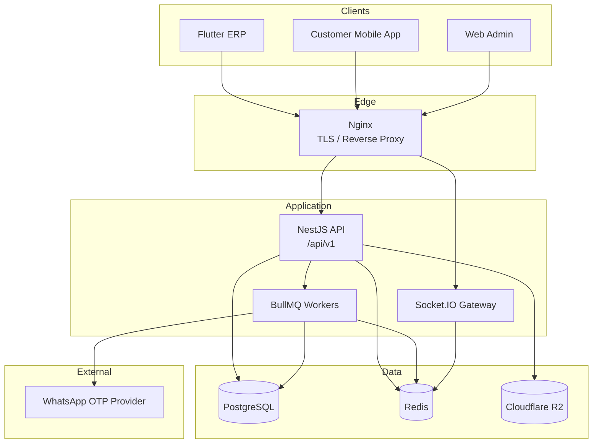

### 3.2 Request Lifecycle

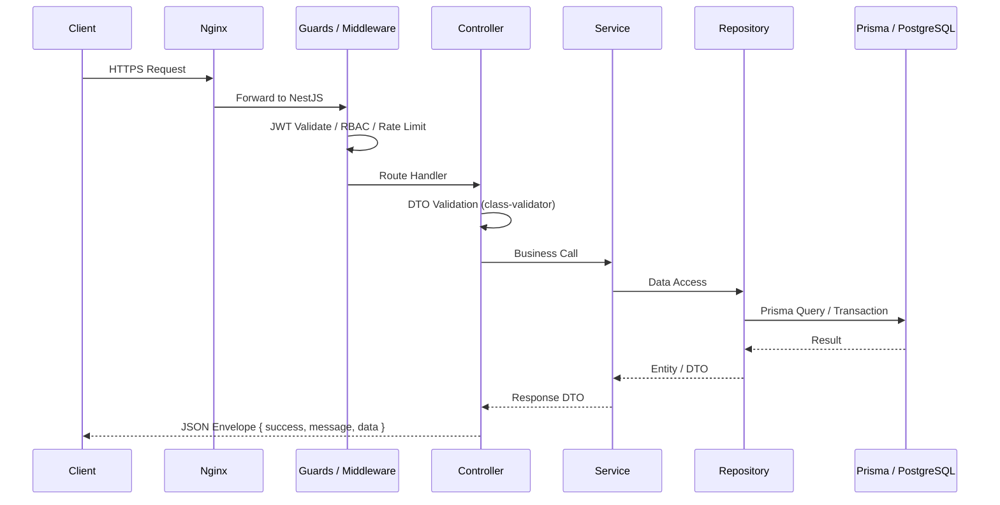

### 3.3 Layer Responsibilities

| Layer | Responsibility | Must NOT |
|-------|----------------|----------|
| **Controller** | HTTP routing, DTO binding, response envelope | Business logic, direct DB access |
| **Service** | Business rules, orchestration, transactions | HTTP concerns |
| **Repository** | Prisma queries, mapping to domain types | Business rule validation |
| **Prisma** | SQL generation, migrations | Application logic |

---

## 4. Project Structure

### 4.1 Root Layout

```
yelo-laundry-api/
├── prisma/
│   ├── schema.prisma
│   ├── migrations/
│   └── seed.ts
├── src/
│   ├── main.ts
│   ├── app.module.ts
│   ├── app/
│   ├── auth/
│   ├── employee/
│   ├── customer/
│   ├── service-catalog/          # laundry service categories & services
│   ├── order/
│   ├── payment/
│   ├── wallet/
│   ├── attendance/
│   ├── ironing/                  # binatu / ironing jobs
│   ├── pickup-delivery/
│   ├── notification/
│   ├── customer-service/
│   ├── settings/
│   ├── expense/                  # owner expenses
│   ├── realtime/                 # Socket.IO gateway
│   ├── queue/                    # BullMQ processors
│   ├── common/
│   ├── database/
│   ├── config/
│   ├── middleware/
│   ├── guards/
│   ├── decorators/
│   ├── interceptors/
│   ├── filters/
│   ├── logger/
│   └── storage/
├── test/
│   ├── unit/
│   ├── integration/
│   └── e2e/
├── .env.example
├── nest-cli.json
├── package.json
└── tsconfig.json
```

### 4.2 Feature Module Template

Each feature module follows a consistent internal structure:

```
src/order/
├── order.module.ts
├── order.controller.ts
├── order.service.ts
├── order.repository.ts
├── dto/
│   ├── create-order.dto.ts
│   ├── update-order.dto.ts
│   └── order-response.dto.ts
├── entities/
│   └── order.entity.ts           # domain types (not Prisma models)
├── enums/
│   └── order-status.enum.ts
├── events/
│   └── order-created.event.ts
└── interfaces/
    └── order.repository.interface.ts
```

### 4.3 Shared (`common/`) Structure

```
src/common/
├── constants/
│   └── role-codes.constant.ts
├── decorators/
│   ├── current-user.decorator.ts
│   ├── roles.decorator.ts
│   └── public.decorator.ts
├── dto/
│   ├── pagination-query.dto.ts
│   └── api-response.dto.ts
├── enums/
├── exceptions/
│   ├── business.exception.ts
│   └── error-codes.enum.ts
├── filters/
│   └── global-exception.filter.ts
├── guards/
│   ├── jwt-auth.guard.ts
│   └── roles.guard.ts
├── interceptors/
│   ├── response-envelope.interceptor.ts
│   └── logging.interceptor.ts
├── middleware/
│   └── request-id.middleware.ts
├── pipes/
│   └── validation.pipe.ts
└── utils/
    ├── phone-normalizer.util.ts
    └── currency.util.ts
```

---

## 5. Module Design

### 5.1 Module Overview

| Module | NestJS Path | DB Tables (ERD) | API Section |
|--------|-------------|-----------------|-------------|
| Auth | `auth/` | `users`, `roles`, `user_roles`, `user_sessions` | §2 |
| Employee | `employee/` | `employees` | §3 |
| Customer | `customer/` | `customers`, `customer_addresses` | §4 |
| Service Catalog | `service-catalog/` | `service_categories`, `services` | §5 |
| Order | `order/` | `orders`, `order_items`, `order_status_logs` | §6 |
| Payment | `payment/` | `payments` | §7 |
| Wallet | `wallet/` | `wallets`, `wallet_transactions` | §8 |
| Attendance | `attendance/` | `attendances`, `attendance_logs` | §9 |
| Ironing | `ironing/` | `ironing_jobs`, `ironing_job_status_logs`, `ironing_queue_settings` | §10 |
| Pickup & Delivery | `pickup-delivery/` | `pickup_delivery_requests`, `pickup_delivery_status_logs` | §11 |
| Notification | `notification/` | `notifications`, `notification_reads` | §12 |
| Customer Service | `customer-service/` | `customer_service_conversations`, `customer_service_messages` | §13 |
| Settings | `settings/` | `laundry_profiles`, `receipt_settings`, `notification_settings`, `order_number_settings`, `user_preferences` | §14 |
| Expense | `expense/` | `expenses` | Owner only |
| Realtime | `realtime/` | — | Socket.IO |
| Queue | `queue/` | — | BullMQ workers |

---

### 5.2 Auth Module

| Attribute | Detail |
|-----------|--------|
| **Purpose** | User authentication, session management, OTP, profile |
| **Responsibilities** | Login, logout, refresh token, OTP send/verify, profile CRUD |
| **Controller** | `AuthController` — `/auth/*` |
| **Services** | `AuthService`, `TokenService`, `OtpService`, `SessionService` |
| **Repository** | `UserRepository`, `SessionRepository`, `RoleRepository` |
| **DTOs** | `LoginDto`, `RefreshTokenDto`, `SendOtpDto`, `VerifyOtpDto`, `UpdateProfileDto` |
| **Dependencies** | `QueueModule` (OTP dispatch), `RedisModule`, `ConfigModule` |

**Key flows:**

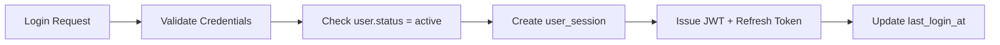

---

### 5.3 Employee Module

| Attribute | Detail |
|-----------|--------|
| **Purpose** | Employee master data management |
| **Responsibilities** | CRUD employees, link to user accounts, role assignment |
| **Controller** | `EmployeeController` — `/employees` |
| **Services** | `EmployeeService` |
| **Repository** | `EmployeeRepository` |
| **DTOs** | `CreateEmployeeDto`, `UpdateEmployeeDto`, `EmployeeResponseDto` |
| **Dependencies** | `AuthModule`, `UserRepository` |
| **Authorization** | `owner` only |

---

### 5.4 Customer Module

| Attribute | Detail |
|-----------|--------|
| **Purpose** | Customer registration and address management |
| **Responsibilities** | CRUD customers, search, phone normalization, wallet auto-create |
| **Controller** | `CustomerController` — `/customers`, `/customers/search` |
| **Services** | `CustomerService`, `CustomerAddressService` |
| **Repository** | `CustomerRepository`, `CustomerAddressRepository` |
| **DTOs** | `CreateCustomerDto`, `UpdateCustomerDto`, `CustomerSearchQueryDto` |
| **Dependencies** | `WalletModule` (auto-create wallet on registration) |
| **Authorization** | `owner`, `cashier`, `cashier_laundry`, `cashier_laundry_driver` |

---

### 5.5 Service Catalog Module

| Attribute | Detail |
|-----------|--------|
| **Purpose** | Laundry service categories and pricing |
| **Responsibilities** | CRUD categories/services, price snapshots for orders |
| **Controller** | `ServiceCategoryController`, `ServiceController` |
| **Services** | `ServiceCategoryService`, `ServiceCatalogService` |
| **Repository** | `ServiceCategoryRepository`, `ServiceRepository` |
| **DTOs** | `CreateServiceDto`, `UpdateServicePriceDto` |
| **Authorization** | Read: all cashier roles; Write: `owner` |

---

### 5.6 Order Module

| Attribute | Detail |
|-----------|--------|
| **Purpose** | Order lifecycle management |
| **Responsibilities** | Create/update/cancel orders, status transitions, queue & order number generation, ironing job creation |
| **Controller** | `OrderController` — `/orders`, `/customers/:id/orders` |
| **Services** | `OrderService`, `OrderStatusService`, `OrderNumberService`, `QueueNumberService` |
| **Repository** | `OrderRepository`, `OrderItemRepository`, `OrderStatusLogRepository` |
| **DTOs** | `CreateOrderDto`, `UpdateOrderDto`, `CancelOrderDto`, `OrderResponseDto` |
| **Dependencies** | `CustomerModule`, `ServiceCatalogModule`, `IroningModule`, `NotificationModule`, `RealtimeModule`, `SettingsModule` |
| **Events** | `OrderCreatedEvent`, `OrderStatusChangedEvent`, `OrderCancelledEvent` |

**Status transition enforcement:** All changes validated against [04_BUSINESS_RULES.md](./04_BUSINESS_RULES.md) §5 and logged to `order_status_logs`.

---

### 5.7 Payment Module

| Attribute | Detail |
|-----------|--------|
| **Purpose** | Order payment recording |
| **Responsibilities** | Cash, QRIS, transfer, wallet payments; update `orders.payment_status` |
| **Controller** | `PaymentController` — `/orders/:id/payments/*`, `/payments` |
| **Services** | `PaymentService`, `PaymentValidationService` |
| **Repository** | `PaymentRepository` |
| **DTOs** | `CashPaymentDto`, `QrisPaymentDto`, `TransferPaymentDto`, `PaymentResponseDto` |
| **Dependencies** | `OrderModule`, `WalletModule`, `NotificationModule`, `RealtimeModule` |
| **Transactions** | Payment + order status update in single DB transaction |

---

### 5.8 Wallet Module

| Attribute | Detail |
|-----------|--------|
| **Purpose** | Customer prepaid wallet |
| **Responsibilities** | Top-up, deduction, balance inquiry, transaction history |
| **Controller** | `WalletController` — `/customers/:id/wallet/*` |
| **Services** | `WalletService`, `WalletTransactionService` |
| **Repository** | `WalletRepository`, `WalletTransactionRepository` |
| **DTOs** | `TopUpDto`, `DeductionDto`, `WalletBalanceResponseDto` |
| **Dependencies** | `PaymentModule`, `NotificationModule` |
| **Transactions** | Balance update + transaction record must be atomic (WAL-021) |

---

### 5.9 Attendance Module

| Attribute | Detail |
|-----------|--------|
| **Purpose** | Employee attendance tracking |
| **Responsibilities** | Check-in/out, history, team summary, late detection |
| **Controller** | `AttendanceController` — `/attendance/*` |
| **Services** | `AttendanceService`, `AttendanceSummaryService` |
| **Repository** | `AttendanceRepository`, `AttendanceLogRepository` |
| **DTOs** | `CheckInDto`, `CheckOutDto`, `AttendanceHistoryQueryDto` |
| **Dependencies** | `EmployeeModule` |
| **Authorization** | Personal: `cashier_laundry`, `cashier_laundry_driver`, `laundry`; Team: `owner` |

---

### 5.10 Ironing Module (Binatu)

| Attribute | Detail |
|-----------|--------|
| **Purpose** | Ironing queue and job management |
| **Responsibilities** | Queue listing, accept/start/finish/ready, priority timer, operator assistance |
| **Controller** | `IroningController` — `/ironing-jobs/*` |
| **Services** | `IroningJobService`, `IroningQueueService`, `IroningPriorityService` |
| **Repository** | `IroningJobRepository`, `IroningJobStatusLogRepository`, `IroningQueueSettingsRepository` |
| **DTOs** | `AcceptJobDto`, `IroningQueueQueryDto`, `IroningJobResponseDto` |
| **Dependencies** | `OrderModule`, `NotificationModule`, `RealtimeModule`, `QueueModule` (priority timer job) |
| **Background Job** | BullMQ cron: scan `waiting_for_binatu` jobs → transition to `waiting_for_operator_assistance` |

---

### 5.11 Pickup & Delivery Module

| Attribute | Detail |
|-----------|--------|
| **Purpose** | Pickup and delivery scheduling |
| **Responsibilities** | List, accept, complete pickup/delivery requests |
| **Controller** | `PickupController`, `DeliveryController` |
| **Services** | `PickupDeliveryService` |
| **Repository** | `PickupDeliveryRepository`, `PickupDeliveryStatusLogRepository` |
| **DTOs** | `AcceptPickupDto`, `CompletePickupDto`, `CompleteDeliveryDto` |
| **Dependencies** | `OrderModule`, `NotificationModule`, `RealtimeModule` |
| **Authorization** | Accept/complete: `cashier_laundry_driver`, `owner` |

---

### 5.12 Notification Module

| Attribute | Detail |
|-----------|--------|
| **Purpose** | In-app notification delivery |
| **Responsibilities** | Create, list, unread count, mark read, respect `notification_settings` |
| **Controller** | `NotificationController` — `/notifications/*` |
| **Services** | `NotificationService`, `NotificationDispatchService` |
| **Repository** | `NotificationRepository`, `NotificationReadRepository` |
| **DTOs** | `NotificationQueryDto`, `MarkReadDto` |
| **Dependencies** | `RealtimeModule`, `QueueModule` |
| **Pattern** | Domain services emit events → `NotificationDispatchService` creates records + Socket.IO push |

---

### 5.13 Customer Service Module

| Attribute | Detail |
|-----------|--------|
| **Purpose** | WhatsApp customer service conversations |
| **Responsibilities** | Conversation list/detail, send messages, upload attachments, AI categorization |
| **Controller** | `CustomerServiceController` — `/customer-service/*` |
| **Services** | `ConversationService`, `MessageService`, `AiCategorizationService` |
| **Repository** | `ConversationRepository`, `MessageRepository` |
| **DTOs** | `SendMessageDto`, `UploadAttachmentDto`, `ConversationQueryDto` |
| **Dependencies** | `StorageModule`, `CustomerModule`, `QueueModule` (AI categorization) |

---

### 5.14 Settings Module

| Attribute | Detail |
|-----------|--------|
| **Purpose** | Outlet and system configuration |
| **Responsibilities** | Company profile, receipt, queue/order numbers, notification toggles, ironing queue, user preferences |
| **Controller** | `SettingsController` — `/settings/*` |
| **Services** | `LaundryProfileService`, `ReceiptSettingsService`, `OrderNumberSettingsService`, `NotificationSettingsService`, `IroningQueueSettingsService`, `UserPreferencesService` |
| **Repository** | Corresponding settings repositories |
| **Authorization** | Owner for system settings; self for `user_preferences` |

---

### 5.15 Expense Module

| Attribute | Detail |
|-----------|--------|
| **Purpose** | Owner operational expense tracking |
| **Responsibilities** | Record expenses with optional receipt image |
| **Controller** | `ExpenseController` — `/expenses` |
| **Services** | `ExpenseService` |
| **Repository** | `ExpenseRepository` |
| **Dependencies** | `StorageModule`, `NotificationModule` |
| **Authorization** | `owner` only |

---

### 5.16 Realtime Module

| Attribute | Detail |
|-----------|--------|
| **Purpose** | Socket.IO gateway for live updates |
| **Gateway** | `EventsGateway` |
| **Services** | `SocketAuthService`, `RoomManagerService` |
| **Dependencies** | `AuthModule`, `RedisModule` (adapter for multi-instance) |

---

### 5.17 Queue Module

| Attribute | Detail |
|-----------|--------|
| **Purpose** | Background job processing |
| **Processors** | `OtpProcessor`, `NotificationProcessor`, `IroningPriorityProcessor`, `AttendanceAbsentProcessor`, `AiCategorizationProcessor` |
| **Dependencies** | `BullModule`, `RedisModule`, all domain modules as needed |

---

## 6. Authentication & Authorization

### 6.1 JWT Access Token

| Property | Value |
|----------|-------|
| Algorithm | HS256 (or RS256 in production) |
| Lifetime | 15 minutes |
| Payload | `{ sub: userId, roles: string[], employeeId?: string, sessionId: string }` |
| Header | `Authorization: Bearer <token>` |

### 6.2 Refresh Token

| Property | Value |
|----------|-------|
| Storage | `user_sessions.refresh_token_hash` (bcrypt hash) |
| Lifetime | 30 days |
| Rotation | New refresh token issued on each refresh |
| Revocation | `user_sessions.revoked_at` set on logout |

### 6.3 OTP Login

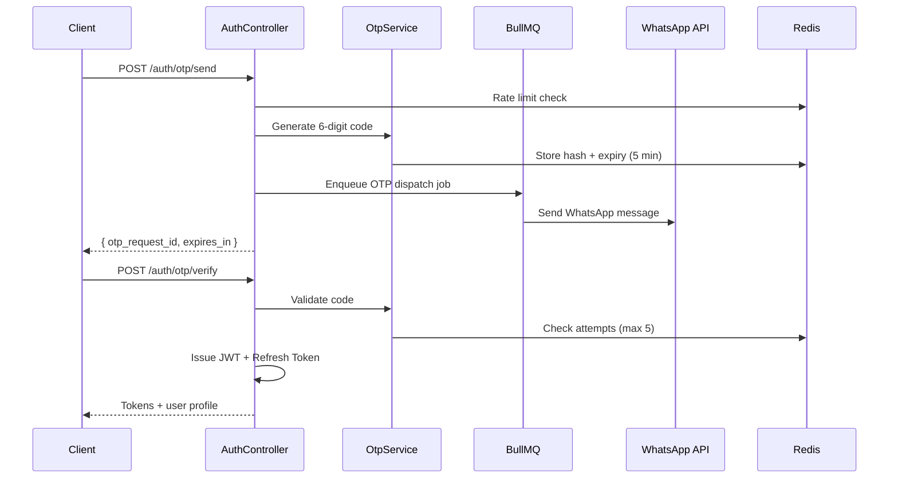

| Rule | Value |
|------|-------|
| OTP length | 6 digits |
| Expiry | 5 minutes |
| Max attempts | 5 per request |
| Rate limit | 3 sends per phone per 15 minutes |

### 6.4 Role-Based Access Control (RBAC)

**Role codes** (from [03_DATA_DICTIONARY.md](./03_DATA_DICTIONARY.md)):

| Code | Display |
|------|---------|
| `owner` | Owner |
| `cashier` | Kasir |
| `cashier_laundry` | Operator |
| `cashier_laundry_driver` | Manajer |
| `laundry` | Binatu |

**Implementation:**

```typescript
// @Roles('owner', 'cashier')
@UseGuards(JwtAuthGuard, RolesGuard)
```

| Component | File | Purpose |
|-----------|------|---------|
| `@Public()` | `public.decorator.ts` | Skip JWT on login/OTP routes |
| `@Roles(...)` | `roles.decorator.ts` | Declare allowed role codes |
| `JwtAuthGuard` | `jwt-auth.guard.ts` | Validate access token |
| `RolesGuard` | `roles.guard.ts` | Check user roles against decorator |
| `@CurrentUser()` | `current-user.decorator.ts` | Inject authenticated user payload |

### 6.5 Permission Middleware

A global **permission map** mirrors [04_BUSINESS_RULES.md](./04_BUSINESS_RULES.md) §3:

| Layer | Mechanism |
|-------|-----------|
| Route level | `@Roles()` guard |
| Service level | `PermissionService.can(user, action, resource)` for fine-grained checks |
| Data level | Repository filters by `employee_id` for personal attendance, assigned jobs |

---

## 7. Database Architecture

### 7.1 Prisma

| Aspect | Decision |
|--------|----------|
| Schema location | `prisma/schema.prisma` |
| Client | `@prisma/client` generated on `prisma generate` |
| Naming | `snake_case` table/column names via `@@map` / `@map` |
| Enums | Application-layer `VARCHAR` validation (per data dictionary); Prisma enums optional |

### 7.2 Migration Strategy

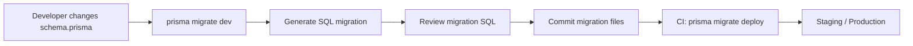

| Environment | Command | When |
|-------------|---------|------|
| Development | `prisma migrate dev` | Local schema changes |
| CI/CD | `prisma migrate deploy` | Staging & production deploy |
| Rollback | Manual down migration SQL | Emergency only |

**Rules:**

- Never edit applied migration files.
- All migrations reviewed in PR.
- Destructive migrations require explicit approval.

### 7.3 Seed Strategy

| Seed File | Content |
|-----------|---------|
| `prisma/seed.ts` | Roles, default owner user, service categories, sample services, `laundry_profiles`, settings defaults |
| Idempotent | Use `upsert` for reference data |
| Environments | Run on dev/staging; production seed only for initial deploy |

```bash
npx prisma db seed
```

### 7.4 Soft Delete

| Table | `deleted_at` |
|-------|--------------|
| `users` | Yes |
| `employees` | Yes |
| `customers` | Yes |
| `orders` | Yes |
| Others | Per [03_DATA_DICTIONARY.md](./03_DATA_DICTIONARY.md) |

**Prisma middleware:**

```typescript
// prisma.$use soft-delete middleware
// Automatically append WHERE deleted_at IS NULL on find operations
// Map delete() to update({ deleted_at: new Date() })
```

### 7.5 UUID Primary Keys

All tables use `UUID` with `gen_random_uuid()` default per data dictionary conventions.

### 7.6 Audit Fields

| Field | Tables | Purpose |
|-------|--------|---------|
| `created_at` | All | Record creation (UTC) |
| `updated_at` | All mutable | Last modification (UTC) |
| `deleted_at` | Soft-deletable | Soft delete timestamp |
| Status logs | `*_status_logs` tables | Full audit trail for orders, ironing, pickup/delivery |

### 7.7 Indexes

Indexes defined in [03_DATA_DICTIONARY.md](./03_DATA_DICTIONARY.md) per table. Prisma schema must replicate all recommended indexes.

**Critical indexes:**

| Index | Reason |
|-------|--------|
| `users.phone` UNIQUE | Login lookup |
| `orders.status`, `orders.payment_status` | Dashboard filters |
| `ironing_jobs.status`, `waiting_started_at` | Queue sorting |
| `notifications.employee_id`, `created_at` | Unread badge count |
| `attendances(employee_id, work_date)` UNIQUE | One record per day |

### 7.8 Transactions

Use `prisma.$transaction()` for multi-table atomic operations:

| Operation | Tables Involved |
|-----------|-----------------|
| Create order | `orders`, `order_items`, `order_status_logs`, sequence increment |
| Wallet deduction | `wallets`, `wallet_transactions`, `payments` |
| Payment | `payments`, `orders` (payment_status), `wallet_transactions` (if wallet) |
| Cancel order | `orders`, `order_status_logs`, refund logic |
| Accept ironing job | `ironing_jobs`, `ironing_job_status_logs` |

**Isolation level:** `ReadCommitted` (PostgreSQL default); use serializable for wallet balance updates if needed.

---

## 8. File Storage

### 8.1 Cloudflare R2 Configuration

| Property | Value |
|----------|-------|
| Protocol | S3-compatible API |
| SDK | `@aws-sdk/client-s3` |
| Access | Pre-signed URLs for upload/download |
| Bucket structure | `{env}/{category}/{year}/{month}/{uuid}.{ext}` |

### 8.2 Storage Categories

| Category | Path Prefix | Max Size | Allowed Types | Module |
|----------|-------------|----------|---------------|--------|
| Receipt images | `receipts/` | 5 MB | `image/jpeg`, `image/png` | Expense |
| Customer attachments | `cs-attachments/` | 5 MB | `image/jpeg`, `image/png`, `application/pdf` | Customer Service |
| Complaint photos | `complaints/` | 5 MB | `image/jpeg`, `image/png` | Customer Service |
| Employee photos | `employees/` | 2 MB | `image/jpeg`, `image/png` | Employee |
| Business logo | `branding/` | 1 MB | `image/png`, `image/svg+xml` | Settings |

### 8.3 Storage Module

```
src/storage/
├── storage.module.ts
├── storage.service.ts          # R2 upload, delete, pre-signed URL
├── storage.config.ts
└── dto/
    └── upload-result.dto.ts
```

**Upload flow:**

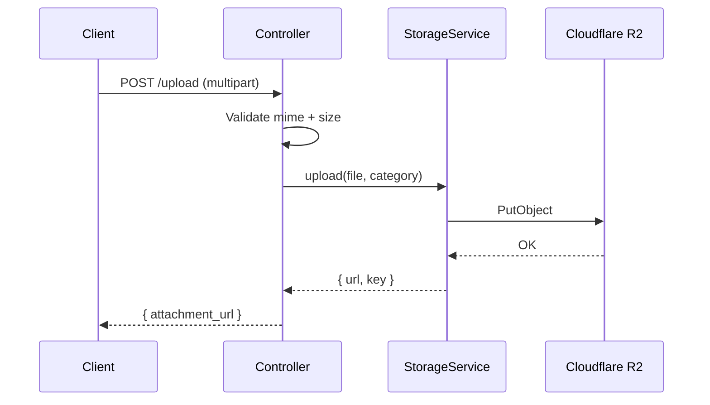

---

## 9. Realtime (Socket.IO)

### 9.1 Gateway Design

| Component | Detail |
|-----------|--------|
| Namespace | `/events` |
| Auth | JWT passed in handshake `auth.token` |
| Rooms | `role:{roleCode}`, `employee:{employeeId}`, `user:{userId}` |
| Adapter | `@socket.io/redis-adapter` for horizontal scaling |

### 9.2 Connection Flow

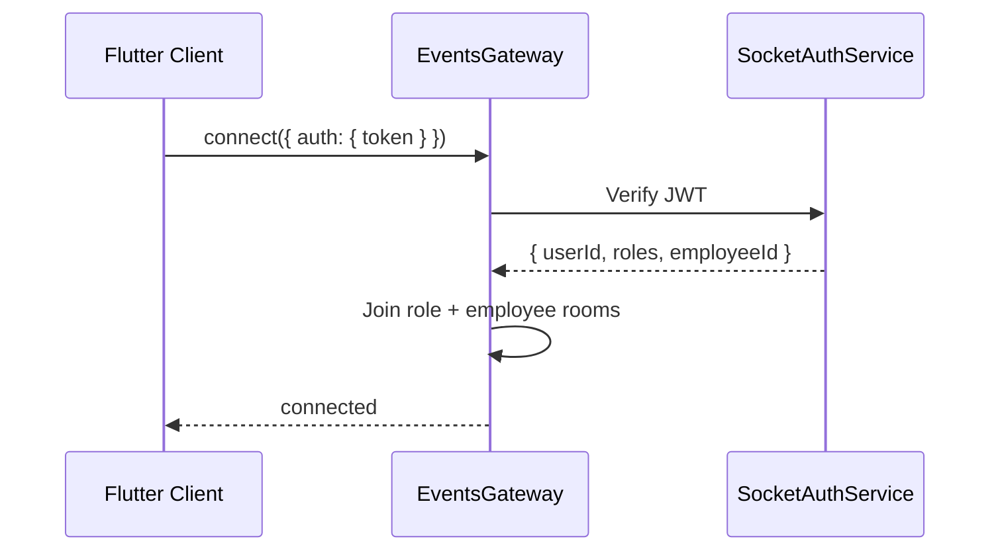

### 9.3 Event Catalog

| Event Name | Direction | Payload | Trigger |
|------------|-----------|---------|---------|
| `order:new` | Server → Client | `{ orderId, orderNumber, queueNumber, customerName }` | Order created |
| `payment:success` | Server → Client | `{ paymentId, orderId, method, amount }` | Payment completed |
| `ironing:accepted` | Server → Client | `{ jobId, orderId, assignedEmployeeId }` | Binatu accepts job |
| `ironing:finished` | Server → Client | `{ jobId, orderId, finishedAt }` | Ironing completed |
| `order:ready_for_pickup` | Server → Client | `{ orderId, queueNumber }` | Ready for pickup |
| `pickup:assigned` | Server → Client | `{ requestId, orderId, driverId }` | Pickup accepted |
| `delivery:assigned` | Server → Client | `{ requestId, orderId, driverId }` | Delivery dispatched |
| `notification:received` | Server → Client | `{ notificationId, type, title, message }` | New notification |
| `ironing:operator_assistance` | Server → Client | `{ jobId, orderId, waitingMinutes }` | Priority timer expired |
| `badge:update` | Server → Client | `{ module, count }` | Badge count changed |

### 9.4 Client Subscription by Role

| Role | Subscribed Rooms | Receives |
|------|------------------|----------|
| `owner` | `role:owner` | All operational events |
| `cashier` | `role:cashier` | Orders, payments, pickup, notifications |
| `cashier_laundry` | `role:cashier_laundry` | + ironing, operator assistance |
| `cashier_laundry_driver` | `role:cashier_laundry_driver` | + pickup/delivery assignments |
| `laundry` | `role:laundry`, `employee:{id}` | Ironing queue, own job updates |

---

## 10. Security

### 10.1 Security Layers

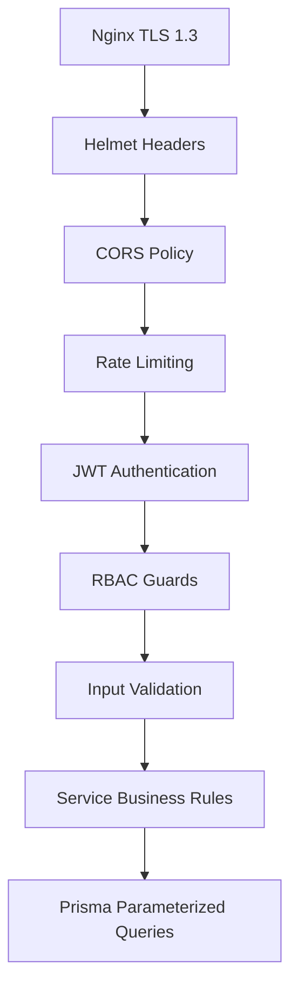

### 10.2 Security Controls

| Control | Implementation |
|---------|----------------|
| **JWT** | Short-lived access tokens; refresh rotation |
| **Password Hash** | bcrypt, cost factor 12 |
| **OTP** | Hashed in Redis; 5-minute expiry; rate limited |
| **Rate Limiting** | `@nestjs/throttler` + Redis; 100 req/min global, 3 OTP/15min per phone |
| **CORS** | Whitelist: Flutter app origins, admin domain |
| **Helmet** | `app.use(helmet())` — CSP, HSTS, X-Frame-Options |
| **Input Validation** | `ValidationPipe({ whitelist: true, forbidNonWhitelisted: true })` |
| **Request Logging** | Pino with request ID; sensitive fields redacted |
| **SQL Injection** | Prisma parameterized queries only |
| **File Upload** | MIME validation, size limits, virus scan (future) |

### 10.3 Sensitive Data Handling

| Data | Storage | Log Policy |
|------|---------|------------|
| Passwords | bcrypt hash only | Never log |
| Refresh tokens | bcrypt hash in DB | Never log |
| OTP codes | bcrypt hash in Redis | Never log |
| Phone numbers | Normalized `+62` in DB | Mask in logs |
| Payment references | Plain in DB | Log transaction ID only |

---

## 11. Error Handling

### 11.1 Global Exception Filter

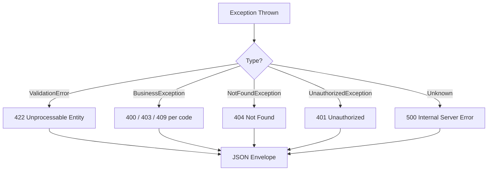

### 11.2 Response Envelope (Errors)

Aligned with [05_API_SPECIFICATION.md](./05_API_SPECIFICATION.md) §1.4:

```json
{
  "success": false,
  "message": "Validation Error",
  "errors": {
    "phone": ["The phone field must be a valid Indonesian mobile number."]
  }
}
```

### 11.3 Error Categories

| Category | HTTP | Exception Class | Example |
|----------|------|-----------------|---------|
| Validation | 422 | `ValidationException` | Invalid phone format |
| Business Rule | 400 | `BusinessException` | Insufficient wallet balance |
| Authorization | 403 | `ForbiddenException` | Binatu accessing payments |
| Authentication | 401 | `UnauthorizedException` | Expired JWT |
| Not Found | 404 | `NotFoundException` | Order not found |
| Conflict | 409 | `ConflictException` | Duplicate phone number |
| Rate Limit | 429 | `ThrottlerException` | OTP rate exceeded |
| Server | 500 | `InternalServerErrorException` | Unhandled error |

### 11.4 Business Error Codes

| Code | Message | Rule Ref |
|------|---------|----------|
| `ORDER_UNPAID_COMPLETION` | Cannot complete unpaid order | ORD-013 |
| `WALLET_INSUFFICIENT_BALANCE` | Insufficient wallet balance | WAL-014 |
| `IRONING_INVALID_TRANSITION` | Invalid ironing status transition | BIN-019 |
| `ATTENDANCE_ALREADY_CHECKED_IN` | Already checked in today | ATT-004 |
| `PAYMENT_EXCEEDS_TOTAL` | Payment exceeds order total | PAY-006 |

---

## 12. Logging

### 12.1 Pino Configuration

| Setting | Value |
|---------|-------|
| Format | JSON (production), pretty (development) |
| Level | `info` (production), `debug` (development) |
| Request ID | `X-Request-Id` header or auto-generated UUID |
| Redaction | `password`, `token`, `otp`, `authorization` |

### 12.2 Log Categories

| Category | Logger Context | Contents |
|----------|----------------|----------|
| **Application** | `AppLogger` | Startup, shutdown, health checks |
| **HTTP** | `LoggingInterceptor` | Method, path, status, duration |
| **Audit** | `AuditLogger` | Order status changes, payment records, role assignments |
| **Payment** | `PaymentLogger` | Payment method, amount, order ID (no card data) |
| **Authentication** | `AuthLogger` | Login success/failure, OTP requests, token refresh |
| **Queue** | `QueueLogger` | Job start, complete, failure, retry |

### 12.3 Audit Log Targets

Written to dedicated `audit_logs` table (future) or structured Pino stream:

| Action | Fields Logged |
|--------|---------------|
| Order status change | `orderId`, `from`, `to`, `changedBy` |
| Payment recorded | `paymentId`, `orderId`, `method`, `amount`, `processedBy` |
| Wallet transaction | `transactionId`, `type`, `amount`, `balanceAfter` |
| Employee created | `employeeId`, `createdBy` |
| Settings changed | `settingKey`, `oldValue`, `newValue`, `changedBy` |

---

## 13. Configuration

### 13.1 Environment Variables

| Variable | Required | Description | Example |
|----------|----------|-------------|---------|
| `NODE_ENV` | Yes | `development`, `staging`, `production` | `production` |
| `PORT` | Yes | HTTP port | `3000` |
| `DATABASE_URL` | Yes | PostgreSQL connection string | `postgresql://...` |
| `REDIS_URL` | Yes | Redis connection string | `redis://localhost:6379` |
| `JWT_SECRET` | Yes | Access token signing secret | — |
| `JWT_EXPIRES_IN` | Yes | Access token TTL | `15m` |
| `JWT_REFRESH_SECRET` | Yes | Refresh token signing secret | — |
| `JWT_REFRESH_EXPIRES_IN` | Yes | Refresh token TTL | `30d` |
| `R2_ACCOUNT_ID` | Yes | Cloudflare account ID | — |
| `R2_ACCESS_KEY_ID` | Yes | R2 access key | — |
| `R2_SECRET_ACCESS_KEY` | Yes | R2 secret key | — |
| `R2_BUCKET_NAME` | Yes | Storage bucket | `yelo-laundry` |
| `R2_PUBLIC_URL` | No | CDN public URL | `https://cdn.yelo-laundry.com` |
| `WHATSAPP_API_URL` | Yes | OTP provider endpoint | — |
| `WHATSAPP_API_TOKEN` | Yes | OTP provider token | — |
| `CORS_ORIGINS` | Yes | Comma-separated allowed origins | `https://app.yelo-laundry.com` |
| `LOG_LEVEL` | No | Pino log level | `info` |
| `THROTTLE_TTL` | No | Rate limit window (seconds) | `60` |
| `THROTTLE_LIMIT` | No | Max requests per window | `100` |

### 13.2 Environment Profiles

| Profile | Database | Redis | R2 Bucket | Logging |
|---------|----------|-------|-----------|---------|
| **Development** | Local PostgreSQL | Local Redis | `yelo-dev` | `debug`, pretty |
| **Staging** | Managed PostgreSQL | Managed Redis | `yelo-staging` | `info`, JSON |
| **Production** | Managed PostgreSQL (HA) | Managed Redis (cluster) | `yelo-prod` | `info`, JSON + external aggregator |

### 13.3 Config Module

```
src/config/
├── config.module.ts
├── app.config.ts
├── database.config.ts
├── jwt.config.ts
├── redis.config.ts
├── storage.config.ts
├── whatsapp.config.ts
└── validation.schema.ts      # Joi validation of env vars at startup
```

---

## 14. Deployment Architecture

### 14.1 Production Topology

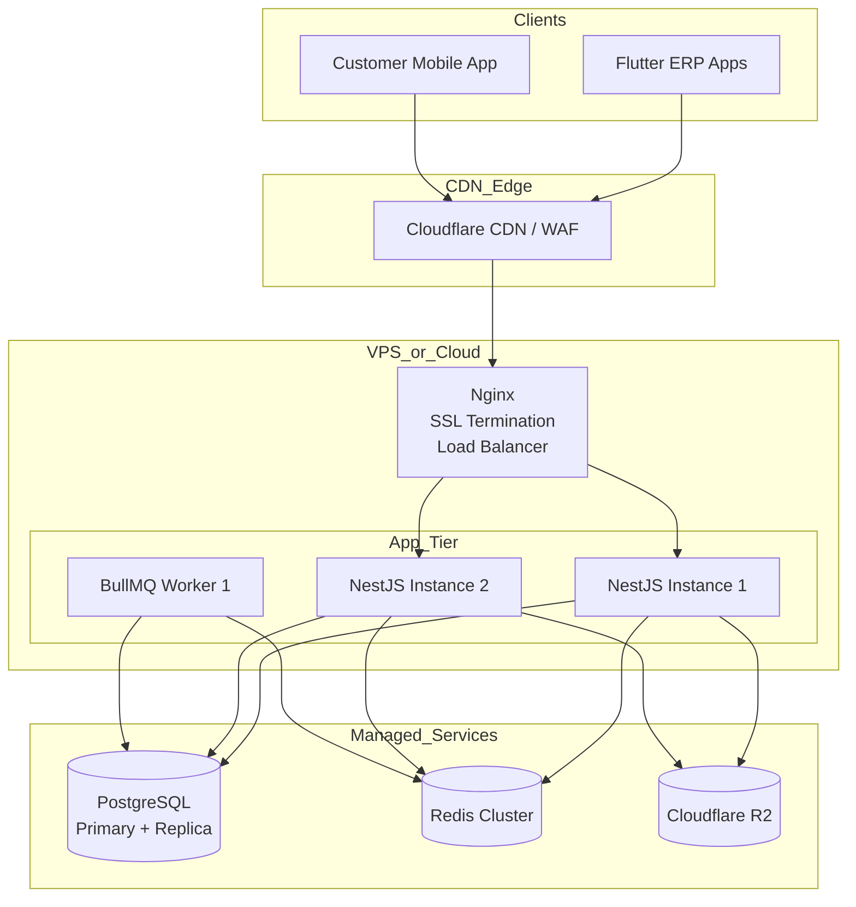

### 14.2 Component Responsibilities

| Component | Responsibility |
|-----------|----------------|
| **Cloudflare** | DNS, WAF, DDoS protection, CDN for R2 public assets |
| **Nginx** | TLS termination, reverse proxy to NestJS, WebSocket upgrade for Socket.IO, static rate limiting |
| **NestJS (×N)** | Stateless API + Socket.IO (Redis adapter) |
| **BullMQ Worker** | OTP dispatch, notifications, ironing timer, absent marking |
| **PostgreSQL** | Primary data store with daily backups |
| **Redis** | Cache, sessions, rate limits, BullMQ, Socket.IO adapter |
| **Cloudflare R2** | File storage |

### 14.3 CI/CD Pipeline

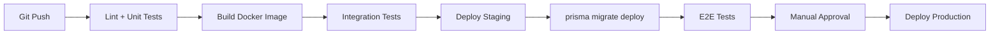

### 14.4 Health Checks

| Endpoint | Purpose |
|----------|---------|
| `GET /health` | Liveness — process running |
| `GET /health/ready` | Readiness — DB + Redis connected |

### 14.5 Docker Services (Development)

```yaml
# docker-compose.yml (reference only — not implemented)
services:
  api:        # NestJS
  worker:     # BullMQ processor
  postgres:   # PostgreSQL 16
  redis:      # Redis 7
```

---

## 15. Best Practices

### 15.1 SOLID in NestJS Context

| Principle | Application |
|-----------|-------------|
| **S** — Single Responsibility | One service per domain concern (e.g. `OrderStatusService` separate from `OrderNumberService`) |
| **O** — Open/Closed | Extend via new modules/events, not modifying existing services |
| **L** — Liskov Substitution | Repository interfaces allow mock implementations in tests |
| **I** — Interface Segregation | Small repository interfaces per aggregate |
| **D** — Dependency Injection | NestJS DI container; inject interfaces via tokens |

### 15.2 Clean Architecture Layers

```
┌─────────────────────────────────────┐
│  Presentation (Controllers, Gateway) │
├─────────────────────────────────────┤
│  Application (Services, DTOs, Events)│
├─────────────────────────────────────┤
│  Domain (Entities, Enums, Rules)    │
├─────────────────────────────────────┤
│  Infrastructure (Repositories, R2,  │
│  Redis, Queue, External APIs)        │
└─────────────────────────────────────┘
```

### 15.3 Repository Pattern

```typescript
// Interface
interface OrderRepository {
  findById(id: string): Promise<Order | null>;
  create(data: CreateOrderData): Promise<Order>;
  updateStatus(id: string, status: OrderStatus): Promise<Order>;
}

// Implementation uses Prisma
@Injectable()
class PrismaOrderRepository implements OrderRepository { ... }
```

### 15.4 Dependency Injection

- Register repositories with custom provider tokens.
- Services depend on interfaces, not concrete Prisma classes.
- Enables unit testing with in-memory mocks.

### 15.5 RESTful Design

- Plural resource names (`/orders`, `/customers`).
- HTTP verbs map to actions (GET read, POST create, PATCH update, DELETE soft-delete).
- Nested resources for relationships (`/orders/:id/payments/cash`).
- Consistent response envelope per API spec.

### 15.6 Feature-Based Modules

- Each domain is a self-contained NestJS module.
- Cross-module communication via:
  - **Exported services** (synchronous)
  - **EventEmitter** (async domain events)
  - **BullMQ** (background processing)

### 15.7 Testing Strategy

| Level | Scope | Tools |
|-------|-------|-------|
| Unit | Services, utilities | Jest |
| Integration | Repositories + Prisma | Jest + test database |
| E2E | Full HTTP flow | Jest + Supertest |
| Contract | API response shape | Matches OpenAPI spec |

---

## 16. Appendix

### 16.1 Module Dependency Graph

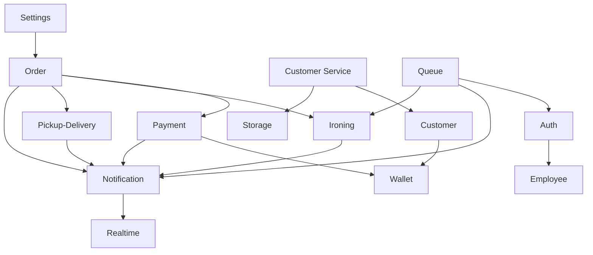

### 16.2 API ↔ Module Mapping

| API Prefix | NestJS Module |
|------------|---------------|
| `/auth` | `AuthModule` |
| `/employees` | `EmployeeModule` |
| `/customers` | `CustomerModule` |
| `/service-categories`, `/services` | `ServiceCatalogModule` |
| `/orders` | `OrderModule` |
| `/payments` | `PaymentModule` |
| `/customers/:id/wallet` | `WalletModule` |
| `/attendance` | `AttendanceModule` |
| `/ironing-jobs` | `IroningModule` |
| `/pickups`, `/deliveries` | `PickupDeliveryModule` |
| `/notifications` | `NotificationModule` |
| `/customer-service` | `CustomerServiceModule` |
| `/settings` | `SettingsModule` |

### 16.3 Related Documents

| Document | Purpose |
|----------|---------|
| [02_ERD.md](./02_ERD.md) | Entity relationships |
| [03_DATA_DICTIONARY.md](./03_DATA_DICTIONARY.md) | Column definitions, indexes, enums |
| [04_BUSINESS_RULES.md](./04_BUSINESS_RULES.md) | Domain rules enforced in services |
| [05_API_SPECIFICATION.md](./05_API_SPECIFICATION.md) | REST API contract |

### 16.4 Implementation Phases

| Phase | Scope | Modules |
|-------|-------|---------|
| **Phase 1** | Core operations | Auth, Employee, Customer, Service Catalog, Order, Payment |
| **Phase 2** | Operations | Wallet, Attendance, Ironing, Pickup-Delivery |
| **Phase 3** | Communication | Notification, Realtime, Customer Service |
| **Phase 4** | Admin | Settings, Expense, reporting endpoints |

---

*This document is the authoritative backend architecture reference for Yelo Laundry ERP implementation.*
