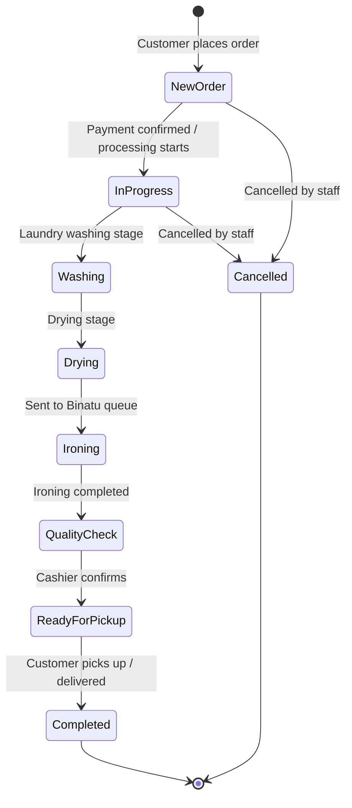
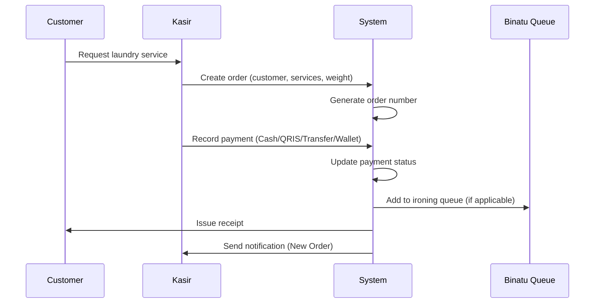
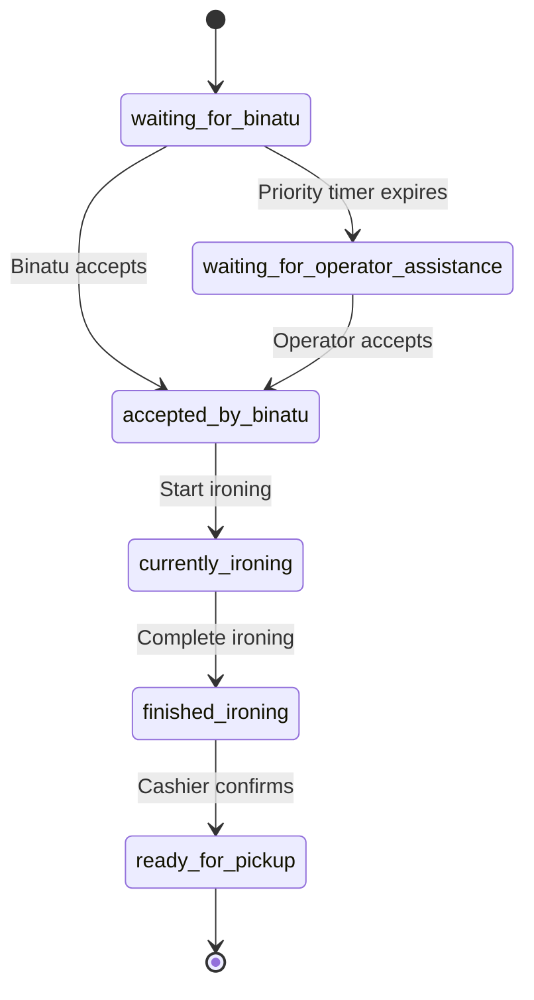
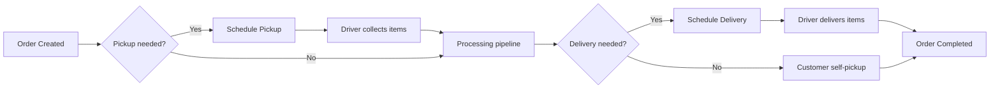

# Yelo Laundry ERP — Order Flow

> **Status:** Draft — lifecycle documentation based on current UI and planned backend behavior.

---

## Order Lifecycle Overview

---

## Stage Definitions

| Stage | Description | Responsible Role |
|-------|-------------|------------------|
| New Order | Order created, awaiting payment or confirmation | Kasir |
| In Progress | Order accepted and entered production pipeline | Operations |
| Washing | Items being washed | Operations |
| Drying | Items being dried | Operations |
| Ironing | Items in Binatu ironing queue / being ironed | Binatu |
| Quality Check | Post-ironing verification | Kasir |
| Ready for Pickup | Order ready — customer notified | Kasir |
| Completed | Order collected or delivered | Kasir / Driver |
| Cancelled | Order voided | Owner / Kasir |

---

## Order Creation Flow

---

## Payment Flow (at Order Creation)

| Step | Action |
|------|--------|
| 1 | Kasir selects customer |
| 2 | Kasir adds service line items |
| 3 | System calculates subtotal, discount, total |
| 4 | Kasir selects payment method |
| 5 | Payment confirmed → order status advances |
| 6 | Notification sent to Notification Center |

### Payment Methods

| Method | Flow |
|--------|------|
| Cash | Immediate confirmation by Kasir |
| QRIS | QR code scan → payment confirmation |
| Transfer | Manual verification → confirmation |
| Wallet | Balance deduction from customer wallet |

---

## Ironing Sub-Flow

Orders requiring ironing enter the Binatu workflow:

---

## Pickup & Delivery Sub-Flow

---

## Order Status Reference (Planned)

| Status Code | Label | Next States |
|-------------|-------|-------------|
| `new` | Order Baru | `in_progress`, `cancelled` |
| `in_progress` | Sedang Diproses | `washing`, `cancelled` |
| `washing` | Sedang Dicuci | `drying` |
| `drying` | Sedang Dikeringkan | `ironing` |
| `ironing` | Sedang Disetrika | `quality_check` |
| `quality_check` | Pemeriksaan Kualitas | `ready_for_pickup` |
| `ready_for_pickup` | Siap Diambil | `completed` |
| `completed` | Selesai | — |
| `cancelled` | Dibatalkan | — |

---

## Order Number Format

| Format | Example | Notes |
|--------|---------|-------|
| _TBD_ | `YL-004291` | Current UI dummy format |

---

## Notifications Triggered by Order Events

| Event | Notification Type | Recipients |
|-------|-------------------|------------|
| Order created | New Laundry Order | Kasir, Operator, Manager |
| Payment success | Payment Success | Kasir |
| Ironing accepted | Binatu Accepted Job | Kasir, Owner |
| Ironing finished | Ironing Finished | Kasir |
| Ready for pickup | Laundry Ready for Pickup | Customer, Kasir |
| Pickup scheduled | Pickup Request | Manager, Driver |
| Delivery scheduled | Delivery Request | Manager, Driver |

---

## Open Items (TBD)

- [ ] Exact order status enum for backend
- [ ] Partial payment rules
- [ ] Order edit after creation rules
- [ ] Refund workflow
- [ ] Express order priority rules
- [ ] Multi-outlet order numbering
