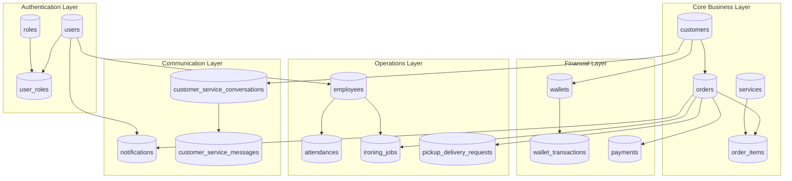

# Yelo Laundry ERP — Database Flow

> **Status:** Draft — describes planned data relationships and access patterns. No database implemented yet.

---

## Database Architecture (Planned)



---

## Primary Data Flows

### 1. Order Creation Flow

```
Customer → Order → Order Items → Services
                ↓
            Payment → Wallet Transaction (if wallet)
                ↓
            Ironing Job (if ironing service)
                ↓
            Notification
```

### 2. Wallet Flow

```
Customer → Wallet
              ↓
    Top Up → Wallet Transaction (credit)
              ↓
    Order Payment → Wallet Transaction (debit) → Payment record
```

### 3. Ironing Flow

```
Order → Ironing Job → Ironing Job Logs
           ↓
    Employee (Binatu) assignment
           ↓
    Status transitions → Notifications
```

### 4. Pickup & Delivery Flow

```
Order → Pickup/Delivery Request
              ↓
    Employee (Driver/Manager) assignment
              ↓
    Status update → Notification
```

### 5. Customer Service Flow

```
Customer → Conversation → Messages
                ↓
         AI Category assignment
                ↓
         Staff response → Notification badge reset
```

---

## Table Relationship Matrix

| From Table | To Table | Cardinality | FK Column |
|------------|----------|-------------|-----------|
| `users` | `employees` | 1:0..1 | `user_id` |
| `users` | `user_roles` | 1:N | `user_id` |
| `roles` | `user_roles` | 1:N | `role_id` |
| `customers` | `orders` | 1:N | `customer_id` |
| `customers` | `wallets` | 1:1 | `customer_id` |
| `customers` | `cs_conversations` | 1:N | `customer_id` |
| `orders` | `order_items` | 1:N | `order_id` |
| `orders` | `payments` | 1:N | `order_id` |
| `orders` | `ironing_jobs` | 1:N | `order_id` |
| `orders` | `pickup_delivery_requests` | 1:N | `order_id` |
| `services` | `order_items` | 1:N | `service_id` |
| `wallets` | `wallet_transactions` | 1:N | `wallet_id` |
| `employees` | `attendances` | 1:N | `employee_id` |
| `employees` | `ironing_jobs` | 1:N | `assigned_employee_id` |
| `ironing_jobs` | `ironing_job_logs` | 1:N | `ironing_job_id` |
| `cs_conversations` | `cs_messages` | 1:N | `conversation_id` |
| `users` | `notifications` | 1:N | `user_id` |

---

## Indexing Strategy (Planned)

| Table | Index | Purpose |
|-------|-------|---------|
| `orders` | `order_number` (unique) | Fast lookup by order number |
| `orders` | `customer_id, order_date` | Customer order history |
| `orders` | `status` | Filter by status |
| `ironing_jobs` | `status, assigned_employee_id` | Binatu queue queries |
| `notifications` | `user_id, is_read` | Unread badge counts |
| `attendances` | `employee_id, work_date` | Daily attendance |
| `pickup_delivery_requests` | `scheduled_date, status` | Today's schedule |
| `customers` | `phone` (unique) | Customer lookup |

---

## Data Integrity Rules (Planned)

| Rule | Enforcement |
|------|-------------|
| Order total = sum of line items | Application + DB constraint |
| Wallet balance ≥ 0 | Application + DB check |
| One wallet per customer | Unique constraint |
| Order number uniqueness | Unique constraint |
| Status transitions | Application layer state machine |
| Soft delete | `deleted_at` column, filtered in queries |

---

## Migration Strategy (Planned)

| Phase | Scope |
|-------|-------|
| Phase 1 | Auth, employees, customers |
| Phase 2 | Orders, services, order items, payments |
| Phase 3 | Wallet, wallet transactions |
| Phase 4 | Ironing jobs, attendance |
| Phase 5 | Pickup & delivery, notifications, customer service |

---

## Current State

| Component | Status |
|-----------|--------|
| Database schema | ❌ Not created |
| ORM / migrations | ❌ Not created |
| Seed data | ❌ Not created |
| Flutter dummy data | ✅ In `lib/features/*/data/` |

---

## Related Documents

- [02_ERD.md](./02_ERD.md) — Entity Relationship Diagram
- [03_DATA_DICTIONARY.md](./03_DATA_DICTIONARY.md) — Field definitions
- [07_ORDER_FLOW.md](./07_ORDER_FLOW.md) — Order lifecycle
